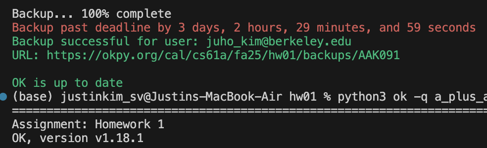
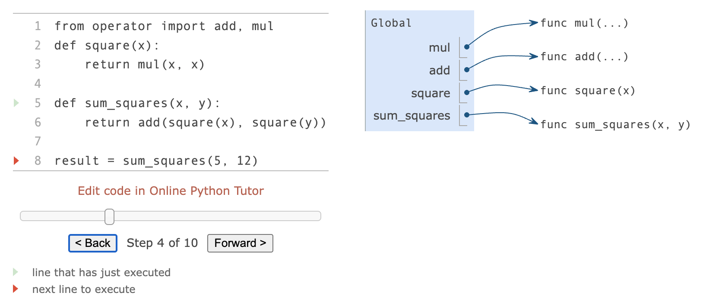
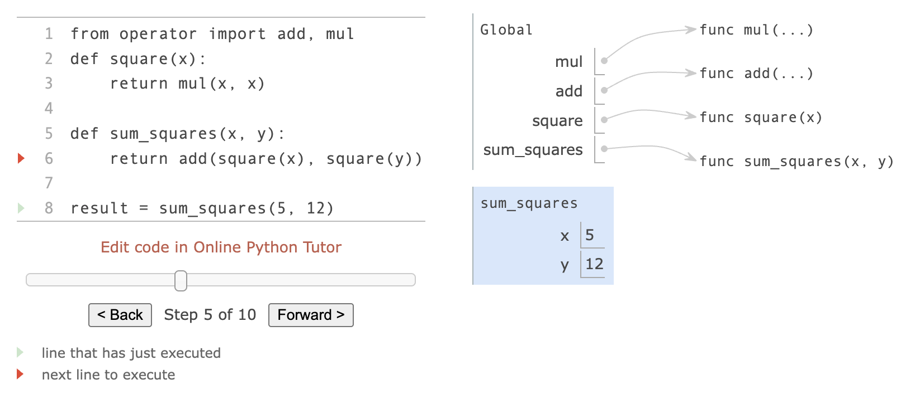
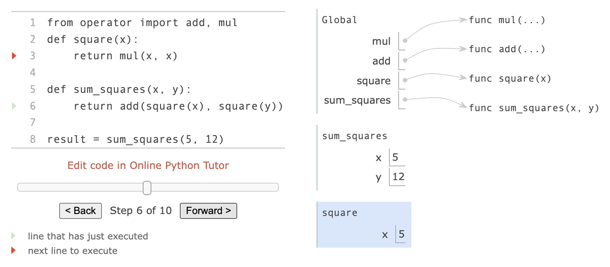
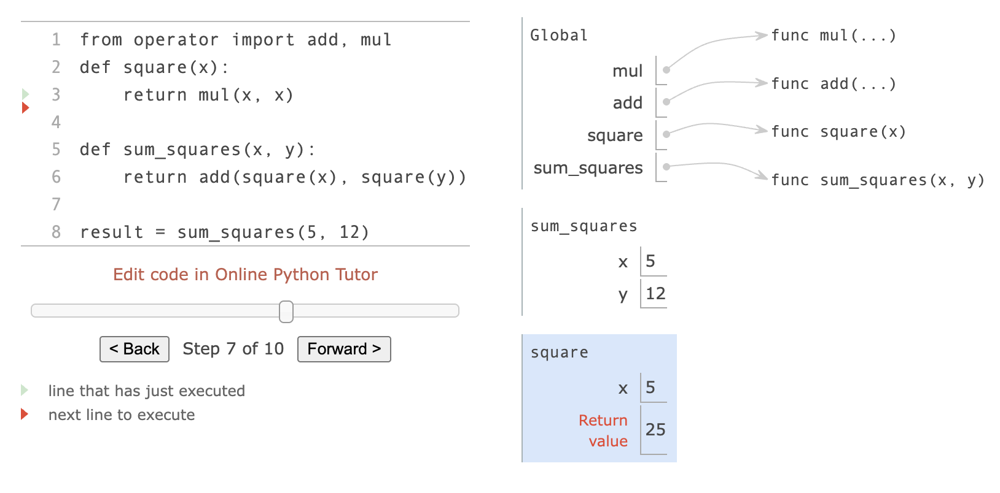
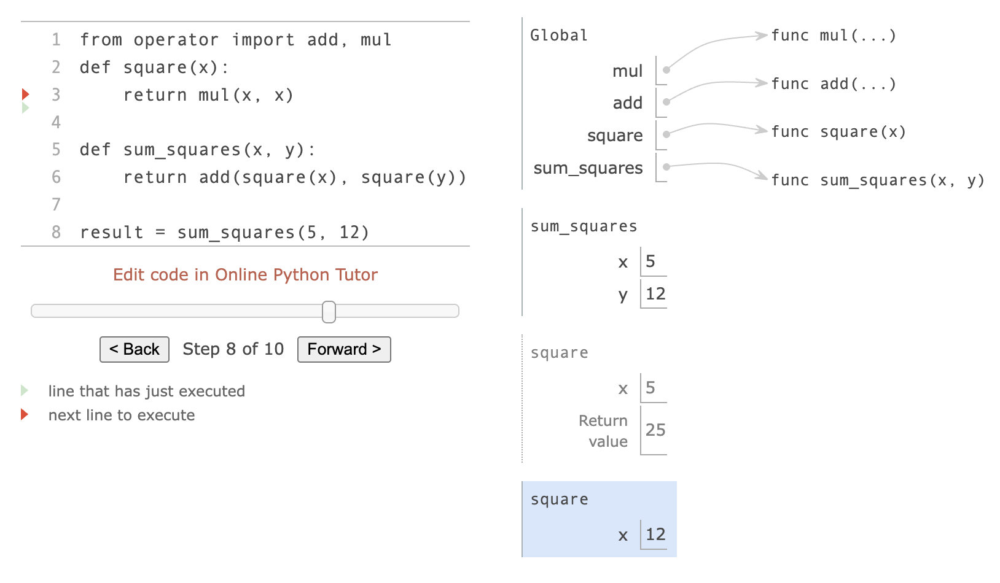
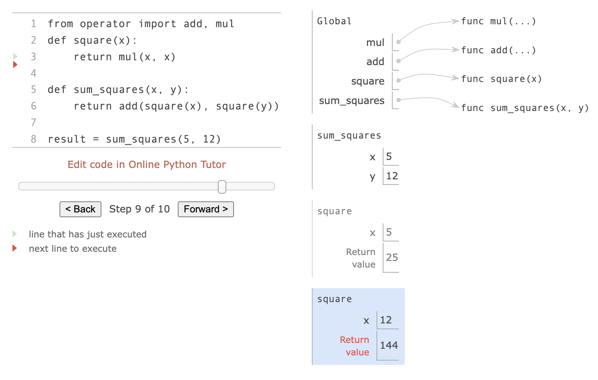
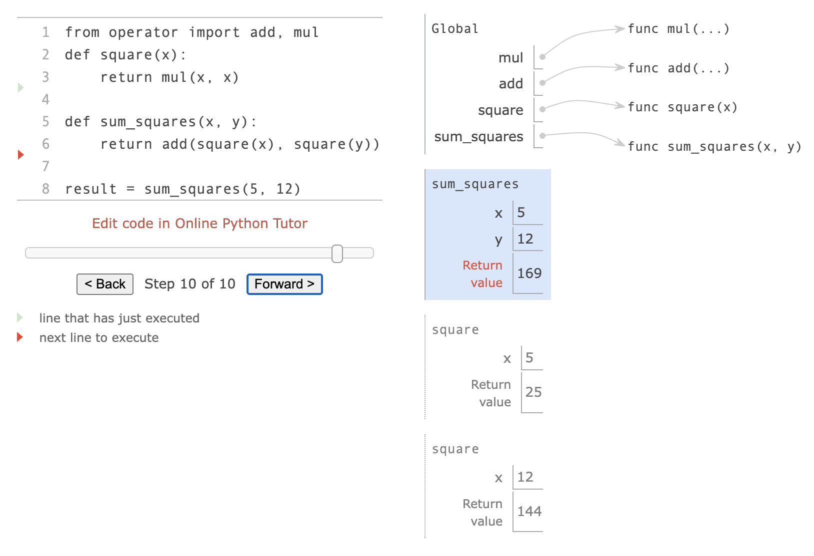
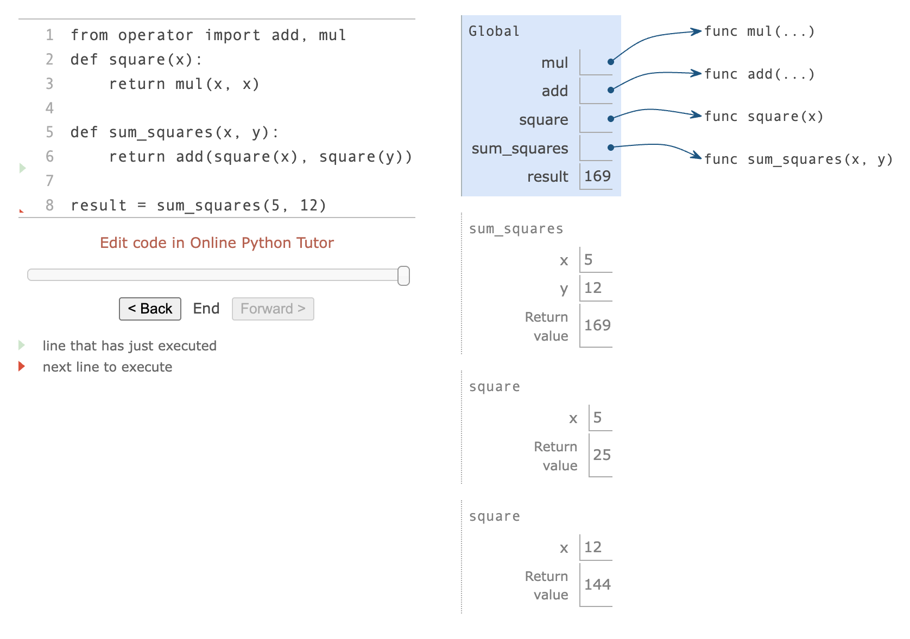

# [CS 61A] Week 1

Hi, I'm Ju Ho Kim and thank you very much for taking your time to visit my website!

From now on, I'll try to upload my study logs like this whenever I can. I'll be writing these with my random thoughts.

It's already the third week of the class, but I've been swamped since it's the beginning of the semester and I know it's a shit of an excuse. Anyways, that's why I'm uploading this now.



For week 1, there were no heavy things yet, but like my professor said,

> "All complex things always begin with fundamentals"

Let's go.

---

## A. Functions

> "Fundamentally, the qualities of good functions all reinforce the idea that **functions are abstractions.**"

This was the first main topic covered in this class.

- **Data** is stuff that we want to manipulate
- **Functions** describe the rules for manipulating the data

<br />

### 1. Non-Pure Print Function

```python
>>> print(print(1), print(2))
1
2
None None
```

#### **print** vs **return**
- The value that `print()` returns is always `None`
- `print()` does not return a useful result
- `print()` is only used so that we can see the intermediate results

```python
def letssee():
    print('You will see this')
    return 'Exiting this function.'    # function call termination
    print('but not this one')

>>> letssee()
You will see this
'Exiting this function.'
```
- when python executes a `return` statement, the function call **terminates** immediately
- `print()` will display text **without the quotes**
- but, `return` will **preserve the quotes**

<br />

### 2. Defining New Functions

```python
def <name>(<formal parameters>):
    return <return expression>
```

<br />

### 3. Calling a User-Defined Functions

**Global** vs. **Local** frame >> must be on the midterm (related to *Environement Diagram*)

An example from our [textbook](https://www.composingprograms.com/pages/13-defining-new-functions.html)

















#### Function Objects vs Function Calls

```python
operation = add     # stores function object
operation(2, 3)     # it works (function object is callable)
```

However,

```python
result = add(2, 3)  # stores function call result 5
result(2, 3)        # ERROR (integer is not callable)
```

You might be thinking who the hell doesn't know this. That's me. I lost points on this today.

So please, on the exam, distinguish whether I need **a function object** or **a function call result**

It was way more important than I thought.
<br />

### 4. Functional Abstraction

Three core attributes of a *functional abstraction*:

- The **domain** of a function is the set of arguments it can take
- The **range** of a function is the set of values it can return
- The **intent** of a function is the relationship it computes between inputs and output (as well as any side effects it might generate)

<br />

### 5. Operators

```python
>>> 5 / 4
1.25

>>> 5 / 0
ZeroDivisionError
```
`/` results in a *floating point* (decimal division)

On the other hand,

```python
>>> 5 // 4
1

>>> 5 // 0
ZeroDivisionError
```
`//` rounds the result *down* to an integer (integer division)

Also,

```python
# modulus operator ⇔ remainder operator

>>> 5 % 4
1

>>> 7 % 3
1

>>> 5 % 0
ZeroDivisionError
```
`%` yields the *remainder* (remainder)

<br />
<br />

---

## B. Control

> "Control statements are statements that control the flow of a program's execution based on the results of logical comparisons."

In other words, **Control** structures make programs smart by
- make decisions (`if` / `else`)
- repeat actions (`while` loops)
- test themselves (assertions)

<br />

### 1. Statements VS Expressions

| Expressions | Statements |
|:---:|:---:|
| calculate values | do actions |
| `2 + 3` gives `5` | `x = 5` stores value |

#### please don't do this
```python
def square(x):
    mul(x, x)           # not recommended, cuz it's useless
                        # calculates but returns nothing
                        # it throws away the result
```
#### instead, do this
```python
def square(x):
    return mul(x, x)    # returns the result
```
<br />

### 2. Compound Statements

```python
# clause = header + suite
header:         # header (ends with ':')
    statement   # suite (indented)
    statement   # suite (indented)
    ...
```
- simple statements: `x = 5`, `return x`
- compound statements: `def`, `if`, `while`

<br />

### 3. Local Assignment

Each function has their **own** workspace in which variables inside don't affect outside of the function

```python
def percent_difference(x, y):
    difference = abs(x-y)    # Local variable
    return 100 * difference / x

# the variable 'difference' only exists inside the function
```

#### Rules for Local Assignment (midterm - environment diagram)

- each function call (not `def` statement) creates **a new local frame**
- assignment statements **bind** names in the local frame only
- cannot affect the global frame

#### benefits
- **Modular**: make programs manageable
- **Safety**: no changes to global variables
- **Clarity**: you know it

<br />

### 4. Conditional Statements

```python
if <expression1>:
    <suite> # do this
elif <expression2>:
    <suite> # do that
else:
    <suite> # otherwise
```

#### sequence of `if`/`else` statement
1. evaluate each condition in order
2. execute suite of first true condition
3. skip all remaining clauses
4. if all conditions false, execute `else` suite (if present)

#### Boolean values
- **False** values: `0`, `None`, `False`, `""`, `[]`
- **True** values: otherwise (including negative numbers)

#### Comparison Operators
```python
4 < 2        # False
5 >= 5       # True
0 == -0      # True (equality comparison)
x = 5        # not comparision, it's "assignment" (different from ==)
```

#### Logical(Boolean) Operators
```python
True and False   # False
True or False    # True
not False        # True
```

#### Logical Operators with **Short-circuiting**
```python
False and expensive_function()  # expensive_function() never called
True or expensive_function()    # expensive_function() never called
```

<br />

### 5. Iteration (`while` loops)

Computers are way better at iterations. We should take advantage of that.

```python
while <expression>:
    <suite>
```

#### sequence of `while` loop

1. evaluate header expression
2. if true, execute entire suite, then return to step 1
3. suite **must** change some binding to prevent infinite loops

#### Fibonacci 

Fibonacci example from [the textbook](https://www.composingprograms.com/pages/15-control.html)

```python
def fib(n):
    """Compute the nth Fibonacci number, for n >= 2."""
    pred, curr = 0, 1   # start with 0, 1
    k = 2               # counter
    while k < n:
        pred, curr = curr, pred + curr  # next number (simultaneous assignment)
        k = k + 1       # update counter
    return curr

result = fib(8)
```

##### Simultaneous Assignment

Look at the sixth line from the Fibonacci example
```python
pred, curr = curr, pred + curr
```

- All expressions on **right** are evaluated first
- Then all bindings on left are updated **simultaneously**

#### Avoid Infinite loops

Infinite loops occur when the suite *never changes* its condition

```python
# bad one
while True:
    print("Forever...")     # I AM COOKED

# good one
count = 0
while count < 5:
    print(count)
    count += 1              # changes the condition
```
<br />

### 6. Testing

to make sure all the functions work as intended

#### Assert Statements

```python
assert fib(8) == 13, 'The 8th Fibonacci number should be 13'
```

- if true: nothing happens
- if false: an ERROR message pops up

#### Test Functions

```python
def fib_test():
    assert fib(2) == 1, 'The 2nd Fibonacci number should be 1'  # '', "" doesn't matter
    assert fib(3) == 1, 'The 3rd Fibonacci number should be 1' 
    assert fib(50) == 7778742049, 'Error at the 50th Fibonacci number'
```

#### Doctests

Another snippet from [the textbook](https://www.composingprograms.com/pages/15-control.html)

```python
# in documentation
def sum_naturals(n):
    """Return the sum of the first n natural numbers.

    >>> sum_naturals(10)
    55
    >>> sum_naturals(100)
    5050
    """
    total, k = 0, 1
    while k <= n:
        total, k = total + k, k + 1
    return total
```

```python
# running Doctests
from doctest import run_docstring_examples
run_docstring_examples(sum_naturals, globals(), True)

# Or from command line:
# python3 -m doctest <python_source_file>
```

**Unit Testing:** testing *individual functions* in isolation

#### Edge Case handling
- special cases like `n = 1`
- handling first and last value output

<br />

### 7. cf.

| Concepts | Syntax | Purpose |
|:---:|:---:|:---:|
| if | `if <condition>:` | make dicisions |
| while | `while <condition>:` | repeat actions |
| assert | `assert condition, "message"` | test functions |
| **local** vars | `variable = value` (inside function) | store temporary values in **local frame** |

<br />
<br />

---

## Assignments

<br />

### Lab 01: Functions

```python
# Lab 1: Functions

"""
Q3: Pick a Digit
Implement digit, which takes positive integers n and k and has only a single return statement as its body. It returns the digit of n that is k positions to the left of the rightmost digit (the one's digit). If k is 0, return the rightmost digit. If there is no digit of n that is k positions to the left of the rightmost digit, return 0.

Hint: Use // and % and the built-in pow function to isolate a particular digit of n.
"""

def digit(n, k):
    """Return the k-th digit from the right of n for positive integers n and k.

    >>> digit(3579, 2)
    5
    >>> digit(3579, 0)
    9
    >>> digit(3579, 10)
    0
    """

    # divide by 10^k
    # then take % 10 to isolate the last digit
    return (n // pow(10, k)) % 10

# ------------------------------------------

"""
Q4: Middle Number
Implement middle by writing a single return expression that evaluates to the value that is neither the largest or smallest among three different integers a, b, and c.

Hint: Try combining all the numbers and then taking away the ones you don't want to return by using the built-in min and max functions.

"""
def middle(a, b, c):
    """Return the number among a, b, and c that is not the smallest or largest.
    Assume a, b, and c are all different numbers.

    >>> middle(3, 5, 4)
    4
    >>> middle(30, 5, 4)
    5
    >>> middle(3, 5, 40)
    5
    >>> middle(3, 5, 40)
    5
    >>> middle(30, 5, 40)
    30
    """
    # add up all three nums
    # subtract the smallest
    # then subtract the largest
    return a + b + c - min(a, b, c) - max(a, b, c)

# ------------------------------------------

"""
Q7: Falling Factorial
Let's write a function falling, which is a "falling" factorial that takes two arguments, n and k, and returns the product of k consecutive numbers, starting from n and working downwards. When k is 0, the function should return 1.
"""
def falling(n, k):
    """Compute the falling factorial of n to depth k.

    >>> falling(6, 3)  # 6 * 5 * 4
    120
    >>> falling(4, 3)  # 4 * 3 * 2
    24
    >>> falling(4, 1)  # 4
    4
    >>> falling(4, 0)
    1
    """

    total = 1

    while k > 0:
        total = total * n
        n -= 1
        k -= 1

    return total

# ------------------------------------------

'''
Q8: Divisible By k
Write a function divisible_by_k that takes positive integers n and k. It prints all positive integers less than or equal to n that are divisible by k from smallest to largest. Then, it returns how many numbers were printed.
'''
def divisible_by_k(n, k):
    """
    >>> a = divisible_by_k(10, 2)  # 2, 4, 6, 8, and 10 are divisible by 2
    2
    4
    6
    8
    10
    >>> a
    5
    >>> b = divisible_by_k(3, 1)  # 1, 2, and 3 are divisible by 1
    1
    2
    3
    >>> b
    3
    >>> c = divisible_by_k(6, 7)  # There are no integers up to 6 that are divisible by 7
    >>> c
    0
    """
    i = 1
    count = 0

    while i <= n:
        if i % k ==0:
            print(i)
            count += 1
        i += 1
    return count

# ------------------------------------------

'''
Q9: Sum Digits
Write a function that takes in a nonnegative integer and sums its digits. (Using floor division and modulo might be helpful here!)
'''
def sum_digits(y):
    """Sum all the digits of y.

    >>> sum_digits(10) # 1 + 0 = 1
    1
    >>> sum_digits(4224) # 4 + 2 + 2 + 4 = 12
    12
    >>> sum_digits(1234567890)
    45
    >>> a = sum_digits(123) # make sure that you are using return rather than print
    >>> a
    6
    """
    sum = 0
    while y > 0:        # must be y > 0 to avoid an infinite loop when y = 0
        sum += y % 10
        y = y // 10
    return sum

# ------------------------------------------

'''
Q10: Double Eights
Write a function that takes in a number and determines if the digits contain two adjacent 8s.
'''
def double_eights(n):
    """Return true if n has two eights in a row.
    >>> double_eights(8)
    False
    >>> double_eights(88)
    True
    >>> double_eights(2882)
    True
    >>> double_eights(880088)
    True
    >>> double_eights(12345)
    False
    >>> double_eights(80808080)
    False
    """
    prev_digit = 0

    while n > 0:
        current_digit = n % 10
        if current_digit == 8 and prev_digit == 8:
            return True
        prev_digit = current_digit
        n = n // 10
    return False
```
<br />

### HW 01: Functions, Control

```python
# Homework 1: Functions, Control

from operator import add, sub

# Q1: A Plus Abs B
# ------------------------
# Python's operator module contains two-argument functions such as add and sub for Python's built-in arithmetic operators. For example, add(2, 3) evalutes to 5, just like the expression 2 + 3.

# Fill in the blanks in the following function to add a to the absolute value of b, without calling the abs function. You may not modify any of the provided code other than the two blanks.
def a_plus_abs_b(a, b):
    """Return a+abs(b), but without calling abs.

    >>> a_plus_abs_b(2, 3)
    5
    >>> a_plus_abs_b(2, -3)
    5
    >>> a_plus_abs_b(-1, 4)
    3
    >>> a_plus_abs_b(-1, -4)
    3
    """
    if b < 0:
        f = sub     # `f` should be a function object (like `sub` or `add`) that can later be called with `a` and `b` as arguments
    else:
        f = add     # likewise
    return f(a, b)

def a_plus_abs_b_syntax_check():
    """Check that you didn't change the return statement of a_plus_abs_b.

    >>> # You aren't expected to understand the code of this test.
    >>> import inspect, re
    >>> re.findall(r'^\s*(return .*)', inspect.getsource(a_plus_abs_b), re.M)
    ['return f(a, b)']
    """
    # You don't need to edit this function. It's just here to check your work.


# Q2: Two of Three
# ------------------------
# Write a function that takes three positive numbers as arguments and returns the sum of the squares of the two smallest numbers. Use only a single line for the body of the function.
def two_of_three(i, j, k):
    """Return m*m + n*n, where m and n are the two smallest members of the
    positive numbers i, j, and k.

    >>> two_of_three(1, 2, 3)
    5
    >>> two_of_three(5, 3, 1)
    10
    >>> two_of_three(10, 2, 8)
    68
    >>> two_of_three(5, 5, 5)
    50
    """
    return i ** 2 + j ** 2 + k ** 2 - max(i, j, k) ** 2

def two_of_three_syntax_check():
    """Check that your two_of_three code consists of nothing but a return statement.

    >>> # You aren't expected to understand the code of this test.
    >>> import inspect, ast
    >>> [type(x).__name__ for x in ast.parse(inspect.getsource(two_of_three)).body[0].body]
    ['Expr', 'Return']
    """
    # You don't need to edit this function. It's just here to check your work.


# Q3: Largest Factor
# ------------------------
# Write a function that takes an integer n that is greater than 1 and returns the largest integer that is smaller than n and evenly divides n.
def largest_factor(n):
    """Return the largest factor of n that is smaller than n.

    >>> largest_factor(15) # factors are 1, 3, 5
    5
    >>> largest_factor(80) # factors are 1, 2, 4, 5, 8, 10, 16, 20, 40
    40
    >>> largest_factor(13) # factors are 1, 13
    1
    """
    "*** YOUR CODE HERE ***"
    k = n - 1       # counter
    while k >= 1:
        if n % k == 0:
            return k
        else:
            k -= 1


# Q4: Hailstone
# ------------------------
# Douglas Hofstadter's Pulitzer-prize-winning book, Gödel, Escher, Bach, poses the following mathematical puzzle.

#   1. Pick a positive integer n as the start.
#   2. If n is even, divide it by 2.
#   3. If n is odd, multiply it by 3 and add 1.
#   4. Continue this process until n is 1.
# The number n will travel up and down but eventually end at 1 (at least for all numbers that have ever been tried—nobody has ever proved that the sequence will terminate). Analogously, a hailstone travels up and down in the atmosphere before eventually landing on earth.

# This sequence of values of n is often called a Hailstone sequence. Write a function that takes a single argument with formal parameter name n, prints out the hailstone sequence starting at n, and returns the number of steps in the sequence:
def hailstone(n):
    """Print the hailstone sequence starting at n and return its
    length.

    >>> a = hailstone(10)
    10
    5
    16
    8
    4
    2
    1
    >>> a
    7
    >>> b = hailstone(1)
    1
    >>> b
    1
    """
    "*** YOUR CODE HERE ***"
    count = 1       # counter

    while n > 0:
        if n == 1:
            print(n)
            return count    # function call termination
        else:
            if n % 2 == 0:
                print(n)
                n = n // 2
            else:
                print(n)
                n = 3 * n + 1
            count += 1
    return count

'''better than mine

def hailstone(n):
    count = 1
    print(n)
    
    while n != 1:
        if n % 2 == 0:
            n = n // 2
        else:
            n = 3 * n + 1
        print(n)
        count += 1
    
    return count
'''
```

<br />
<br />
<br />

## Wrapping Up

> **computer = powerful + stupid**

That's why I need to do well on this.

<br />
<br />

Thank you.


---
## References

[1] DeNero, J. (2024). *Composing Programs*. University of California, Berkeley. Retrieved from https://www.composingprograms.com/
   - Course textbook for UC Berkeley CS 61A: Structure and Interpretation of Computer Programs

[2] Guo, P. (2013). *Online Python Tutor: Composing Programs*. Interactive visualization tool for understanding program execution and environment diagrams. Retrieved from https://pythontutor.com/cp/composingprograms.html#mode=edit