# [CS 61A] Week 2

Hi, I'm Ju Ho Kim and thank you very much for taking your time to visit my website!

On Week 2, which was the last week, we went over the chapter named "Higher-Order Functions" and I'll write about it in this post, while studying.

Also, it's pretty amazing and daunting that our midterm1 is coming in less than a week from this point. I'm definitely cooked.

<br />

lez gou

---

## Higher-Order Functions

The main idea for this section is **instead of just computing with numbers and data, we can compute with functions themselves.**

As written on [our textbook](https://www.composingprograms.com/pages/16-higher-order-functions.html),

> "Functions that manipulate other functions are called **higher-order functions**"

They can either:

- accept other functions as "arguments" or
- return functions as "values"

<br />

### 1. Functions as "Arguments"

#### *the problem*: Repetitive Patterns

take a look at these three functions:

- Sum of cubes of natural numbers up to n:

```python
def sum_cubes(n):
    total, k = 0, 1
    while k <= n:
        total, k = total + k*k*k, k + 1
    return total
```

- Sum of natural numbers up to n:

```python
def sum_naturals(n):
    total, k = 0, 1
    while k <= n:
        total, k = total + k, k + 1
    return total
```

- Sum of terms in a series that converges to pi:

```python
def pi_sum(n):
    total, k = 0, 1
    while k <= n:
        total, k = total + 8 / ((4*k-3) * (4*k-1)), k + 1
    return total
```

These three above share the same template:

```python
def <name>(n):
    total, k = 0, 1
    while k <= n:
        total, k = total + <term>(k), k + 1
    return total
```

The only difference is what gets added each time: `k`, `k*k*k`, or `8 / ((4*k-3) * (4*k-1))`

Then how can we reduce this kind of repetition.

#### *the solution*: Abstract the Pattern with Higher-Order Functions

extract the common pattern and create a generalized function:

```python
# generalized function
def summation(n, term):
    """Compute the sum of terms up to n using the term function"""
    total, k = 0, 1
    while k <= n:
        total, k = total + term(k), k + 1
    return total


def cube(x):
    return x * x * x

def identity(x):
    return x

def pi_term(x):
    return 8 / ((4*x-3) * (4*x-1))

# now, we can express summations succinctly
def sum_cubes(n):
    return summation(n, cube)

def sum_naturals(n):
    return summation(n, identity)

def pi_sum(n):
    return summation(n, pi_term)
```

As we can see above, the generalized function `summation(n, term)` takes a function `term` as an argument.

```python
>>> sum_cubes(3)        # 1 + 8 + 27 = 36
36
>>> sum_naturals(10)    # 1 + 2 + ... + 10 = 55
55
>>> pi_sum(1e6)         # approximation to pi
3.141592153589793       # 1e6 is same with 1*(10^6)
```

[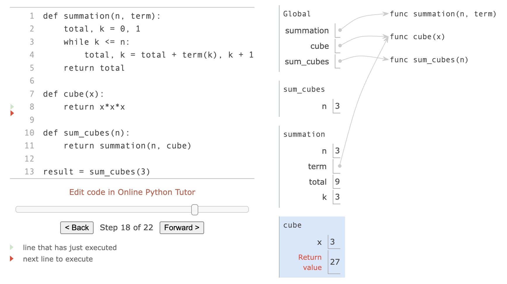](https://www.composingprograms.com/pages/16-higher-order-functions.html)

<br />

### 2. Functions as General Methods

#### Iterative Improvement algorithm

follows this general method:

1. start with an **initial** guess
2. repeatedly apply an **update function** to improve the guess
3. stop when the guess is **close enough** to be considered correct

```python
def improve(update, close, guess = 1):
    """
    update: function that improves the guess
    close: function that checks if the guess is close enough
    guess: initial guess
    """
    while not close(guess):
        guess = update(guess)
    return guess
```
In this `improve()` function, as we can see, `update` and `close` are passed in as arguments.

This is a general expression of iterative improvement.

##### ex. computing the golden ratio

Another example from [the text book](https://www.composingprograms.com/pages/16-higher-order-functions.html):

```python
def improve(update, close, guess = 1):  # passed in `update` and `close` as arguments
    while not close(guess):
        guess = update(guess)
    return guess

def golden_update(guess):
    # golden ratio update rule: (1 / guess) + 1
    return (1 / guess) + 1

def square_close_to_successor(guess):
    # check if the square of guess is approximately equal to (guess + 1)
    return approx_eq(guess * guess, guess + 1)

def approx_eq(x, y, tolerance = 1e-3):
    # check if two values are approximately equal
    return abs(x - y) < tolerance

# compute the golden ratio
phi = improve(golden_update, square_close_to_successor)
```

Unit Testing (to test the `improve()` function)
```python
>>> from math import sqrt
>>> phi = 1/2 + sqrt(5)/2   # expected value                                         
>>> def improve_test():
        approx_phi = improve(golden_update, square_close_to_successor)  # actual value
        assert approx_eq(phi, approx_phi), 'phi differs from its approximation'     # assert statement

>>> improve_test()
```

<br />

### 3. Nested Definitions

#### *the problem*: Global Frame Clutter

One good thing that we saw from the previous examples is that by **passing the functions as arguments**, we could make the program more flexible

But, these also give us two problems that need to be solved in order to learn **Nested Definitions**, which will be covered later in this section 😂

1. the global frame gets cluttered with names of small functions
2. functions must fit particular *function signatures* (like `improve` expecting single-argument functions `update()` and `close()`)
- both `update()` and `close()` take single arguement `guess`

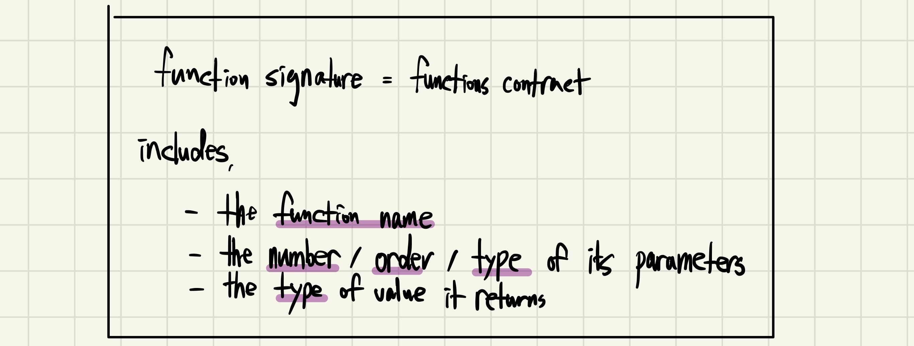

So, the solution is:

#### *the solution*: Locally Defined Functions (not "local assignment")

In other words, **define functions inside functions**

```python
def sqrt(a):
    """Compute the square root of a using Newton's method"""
    
    def sqrt_update(x):
        """Square root update rule"""
        return average(x, a/x)  # a is from the enclosing function `sqrt()`
    
    def sqrt_close(x):
        """Check if x² is close enough to a"""
        return approx_eq(x * x, a)  # a is used here too
    
    return improve(sqrt_update, sqrt_close)

def average(x, y):
    return (x + y) / 2

# Usage
print(sqrt(256))  # 16.0
```

##### Lexical Scope

From the above, we can see how the `sqrt_update` and `sqrt_close` refer to the name `a`.

This discipline of sharing names among nested definitions is called **lexical scoping**. Additionally, the inner functions have access to the names in the environment where they are defined (not where they are called).

Here are two extensions to enable lexical scoping, which is essential to draw environment diagrams that I learned this week and my professor said there will be at least one problem each on upcoming midterm1, and the final as well.

1. Each user-defined function has a parent environment: the environment in which it was defined
2. When a user-defined function is called, its local frame extends its parent environment

[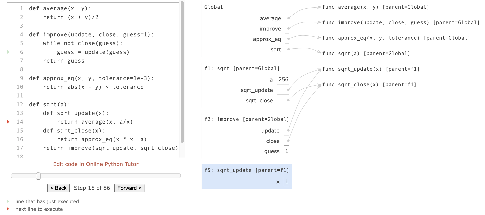](https://www.composingprograms.com/pages/16-higher-order-functions.html)

#### Program Design

> "There's three principles that are very important when you're designing programs: **Modularity**, **Abstraction**, **Separation of Concerns**"

- **Modularity** is how you break your programs up into different modules that can be used
- **Abstraction** is what the interface is to those modules
- **Separation of Concerns** is this idea that if you focus on one module, you don't have to thing about what's going on in the other ones.

##### ex. Twenty-One Game

An example from the classroom:

```python
# ex. Twenty-One Rules

"""
Two players alternate turns, on which they can add 1, 2, or 3 to the current total
The total starts at 0
The game end whenever the total is 21 or more
The last player to add to the total loses
"""

def play(strategy0, strategy1, goal = 21):
    current_score = 0
    player0 = 0
    player1 = 1
    current_player = player0

    while current_score < 21:
        if current_player == player0:
            # Do Player0's turn
            current_score += strategy0(current_score)
            current_player = player1
        else:
            # Do Player1's turn
            current_score += strategy1(current_score)
            current_player = player0
    print("Player", current_player, "wins the game")


def simple_strategy(s):
    if s < 15:
        return 3
    else:
        return 2
    
def interactive(s):
    print("Current score", s, "what do you want to play? (1 - 3)")
    return int(input())

def make_heckling_strategy(strategy, heckle):   # functions within other functions
    def heckling_strategy(s):
        print(heckle)
        return strategy(s)
    return heckling_strategy

play(
    make_heckling_strategy(simple_strategy, "you're going down!"),
    make_heckling_strategy(simple_strategy, "my strategy isn't very good"),
    500
)

'''
mean_abs = make_heckling_strategy(abs, "you're going down")
mean_abs(-3)
'''
```

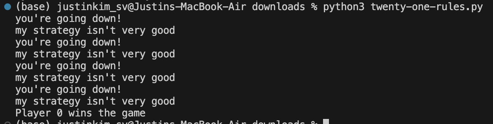

This example demonstrates:
- **Modularity**: Each strategy is a separate function
- **Abstraction**: The game logic is separated from player strategies  
- **Separation of Concerns**: Game rules, strategies, and interaction are handled separately

<br />

### 4. Functions as Returned values

functions can also be returned as values from other functions:

```python
def compose1(f, g):
    """Return a function that composes f and g"""
    def h(x):
        return f(g(x))  # f and g are from their enclosing function `compose1()`
    return h

def square(x):
    return x * x

def successor(x):
    return x + 1

square_successor = compose1(square, successor)
print(square_successor(12))
```

#### Newton's Method

is an example of a iterative approach to finding the zeros of a function.

It finds function zeros by following tangent lines.

[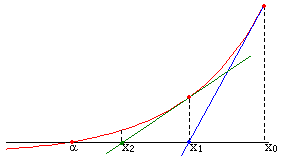](https://en.wikipedia.org/wiki/Newton%27s_method)

```python
def newton_update(f, df):
    """return the update function for Newton's method"""
    def update(x):
        return x - f(x) / df(x)  # Newton's formula (follow the tangent line)
    return update

def find_zero(f, df):
    """find a zero of function f using its derivative df"""
    def near_zero(x):
        return approx_eq(f(x), 0)
    return improve(newton_update(f, df), near_zero)

# Computing square roots: find x where x^2 - a = 0
def square_root_newton(a):
    def f(x):
        return x * x - a  # f(x) = x^2 - a
    
    def df(x):
        return 2 * x      # f'(x) = 2x
    
    return find_zero(f, df)

print(square_root_newton(64))  # 8.0
```

<br />

### 5. Currying

This is a way of converting a function that takes multiple arguments into a chain of functions, each taking a single argument. It's confusing. So, let's see the code below:

- regular power function

```python
def pow(x, y):
    return x ** y
```

- curried version

```python
def curried_pow(x):
    def h(y):
        return pow(x, y)
    return h
```

- comparison
```python
print(pow(2, 3))         # 8
print(curried_pow(2)(3)) # 8

pow_of_2 = curried_pow(2)
print(pow_of_2(3))  # 8
print(pow_of_2(4))  # 16
```

#### Automatic Currying Functions

```python
def curry2(f):
    """return a curried version of the given two-argument function"""
    def g(x):
        def h(y):
            return f(x, y)
        return h
    return g

def uncurry2(g):
    """return a two-argument version of the given curried function"""
    def f(x, y):
        return g(x)(y)
    return f

'''
example)
>>> pow_curried = curry2(pow)
>>> pow_curried(2)(5)

convert back to normal function,
>>> uncurry2(pow_curried)(2, 5)
32
'''
```

<br />

### 6. Lambda(λ) Expressions

> "In Python, we can create function values on the fly using lambda expressions, which evaluate to unnamed functions."

(must be on the midterm1)

Traditional way:
```python
def square(x):
    return x * x
```

Lambda Expression (not common in Python, but important in general):
```python
square_lambda = lambda x: x * x

>>> square(5)
25
>>> square_lambda(5)
25
```

#### lambda structure

```
     lambda            x            :          f(g(x))
"A function that    takes x    and returns     f(g(x))"
```

- **Lambda function**: the result of a **lambda expression** (works perfectly fine as any of a function, but has no name)

#### `lambda` Expressions vs. `def` Statements

- `lambda` Expression:

```python
square = lambda x: x * x
```

- `def` Statement:

```python
def square(x):
    return x * x
```

| | `lambda` Expressions | `def` Statements |
| :---: | :---: | :---: |
| Common 1 | both create a function with the same domain, range, and behavior | likewise |
| Common 2 | both functions have as their parent the frame in which they were defined | likewise |
| Common 3 | both bind that function to the name `square` (from the example above) | likewise |
| Difference | - | only the `def` statement gives the function as intrinsic name |

In other words,
- A `def` statement creates a fucntion and **binds it to a name**
- A `lambda` expression creates a function but **doesn't bind it to a name**

<br />

### 7. Abstractions and First-Class Functions

1. Bound to names

```python
my_func = square
```

2. Passed as arguments

```python
summation(10, square)
```

3. Returned as results

```python
def get_operation():
    return square
```

4. Included in data structures

```python
operations = [square, cube, lambda x: x + 1]
for op in operations:
    print(op(3))  # 9, 27, 4
```

<br />

### 8. Function Decorators

> "Python provides special syntax to apply higher-order functions as part of executing a def statement, called a **decorator**."

We place it with an `@` sign, just before the function that we want to define and it changes the behavior of the function to print out.

So that we can see exactly what's happening and in what order as we execute the body of the function.

Here is a trace, the most common example of Decorators:

```python
>>> def trace(fn):
        def wrapped(x):
            print('-> ', fn, '(', x, ')')
            return fn(x)
        return wrapped

>>> @trace
    def triple(x):
        return 3 * x
```

This decorator `@trace` is equivalent to:

```python
>>> def triple(x):
        return 3 * x

>>> triple = trace(triple)
```

Output:

```python
>>> triple(12)
->  <function triple at 0x102a39848> ( 12 )
36
```
<br />

---

## Assignments

<br />

### [Lab 02: Higher-Order Functions, Lambda Expressions](https://cs61a.org/lab/lab02/)

#### Q1: WWPD: The Truth Will Prevail

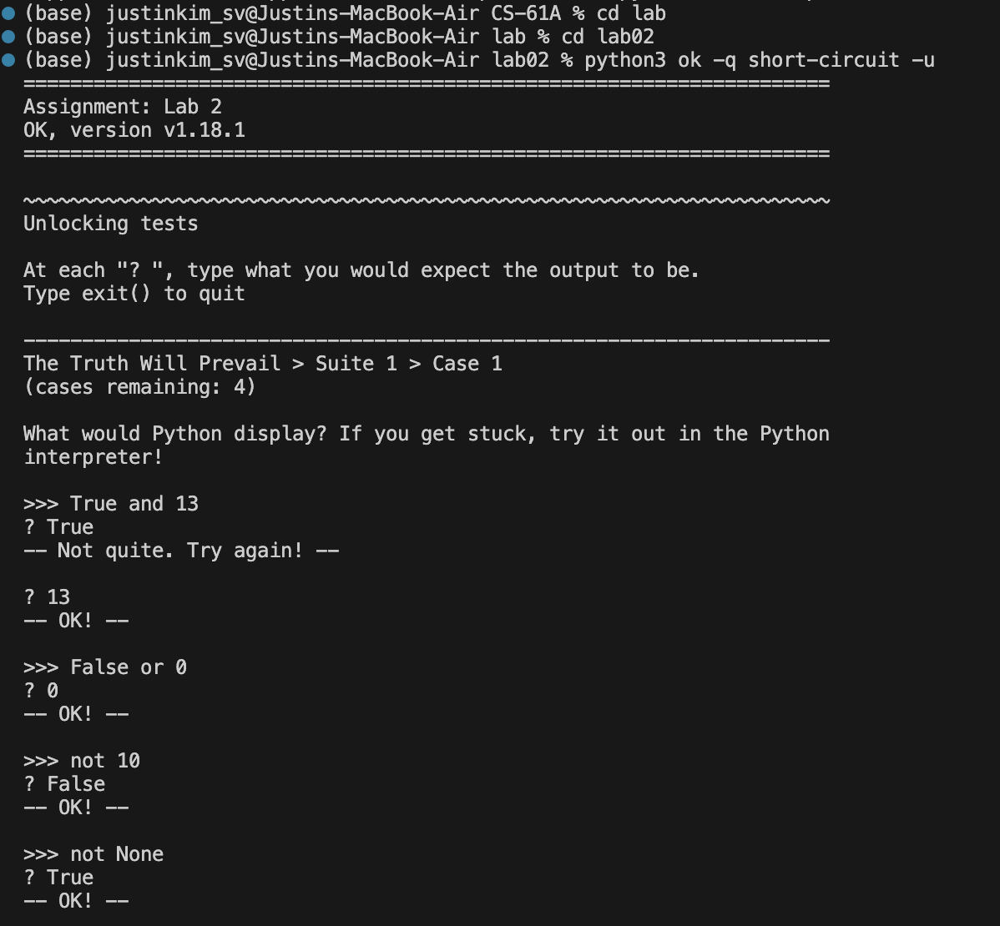

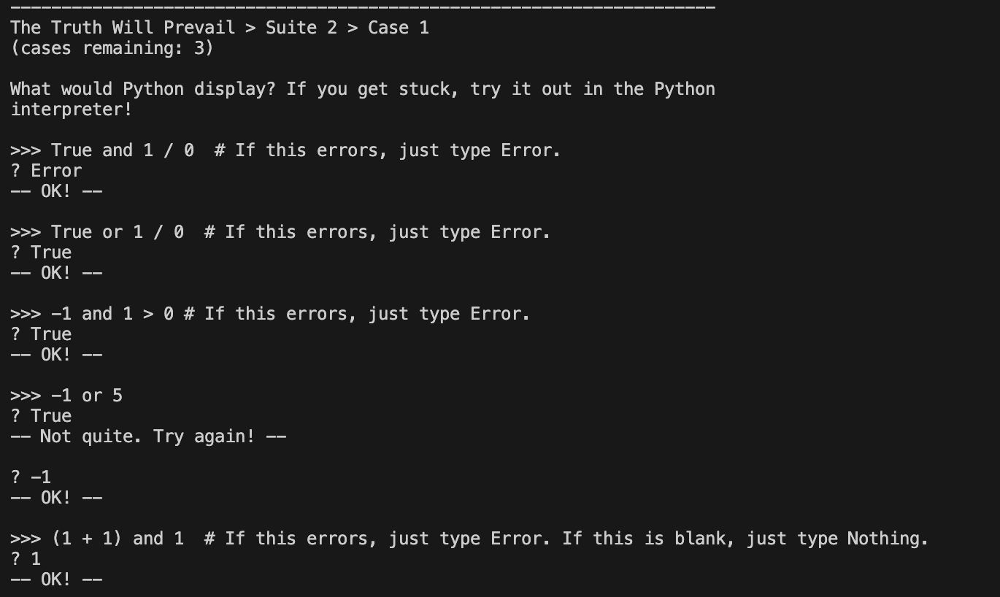

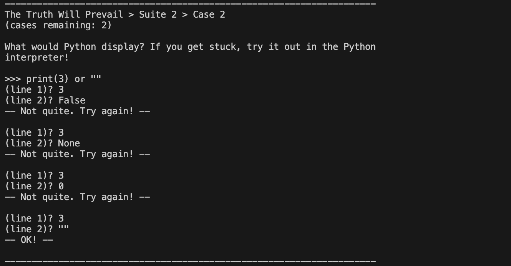

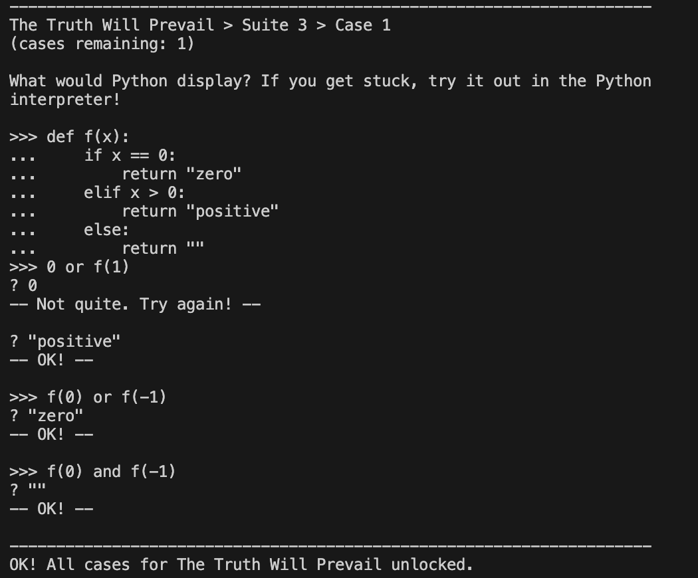

#### Q2: WWPD: Higher-Order Functions

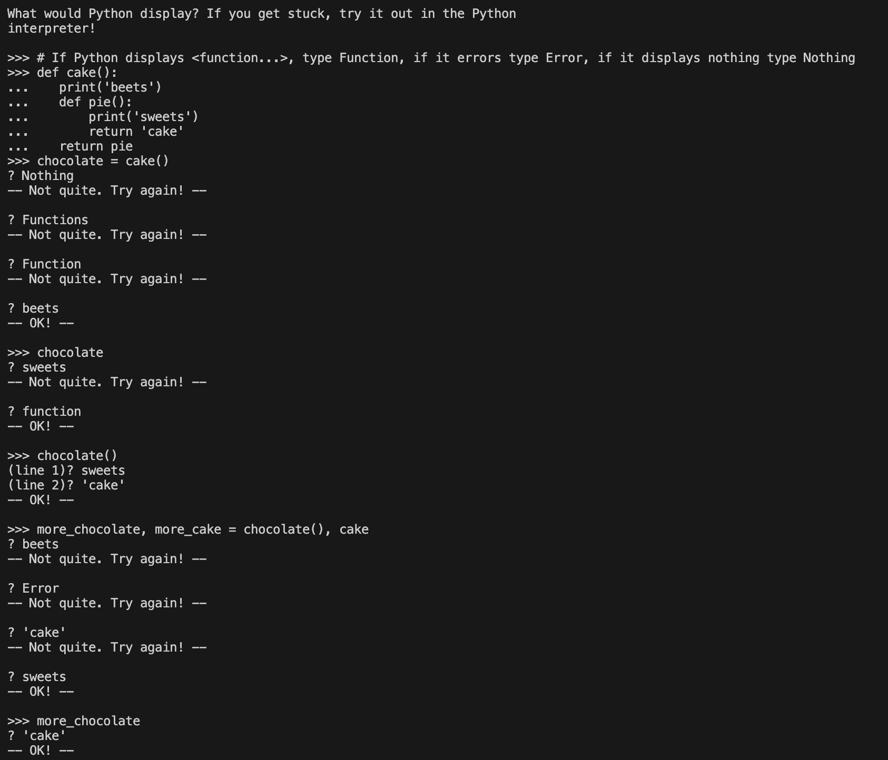

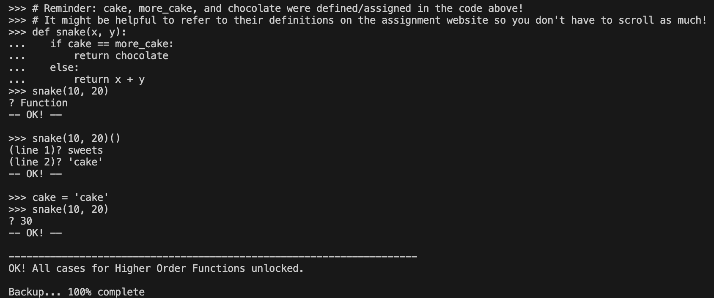

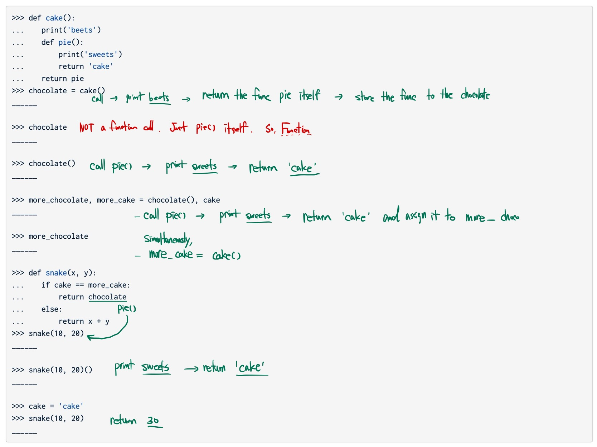

#### Q3: WWPD: Lambda

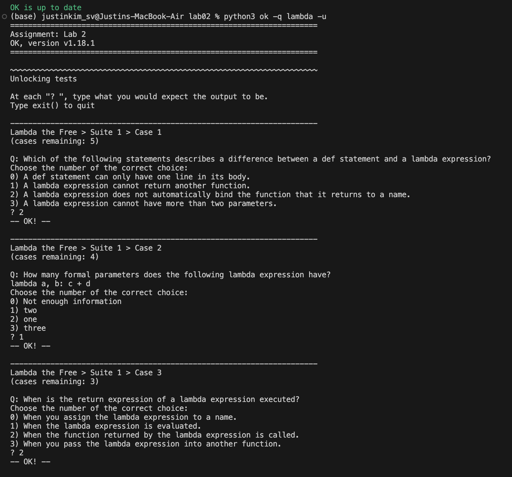

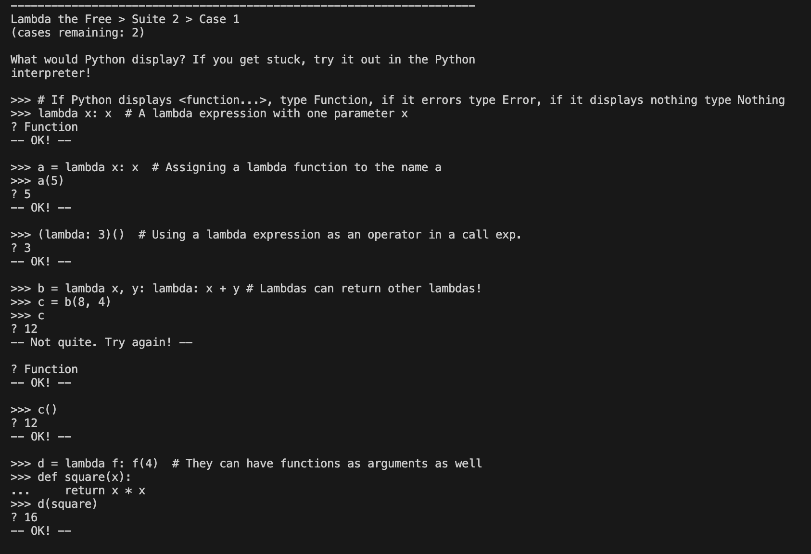

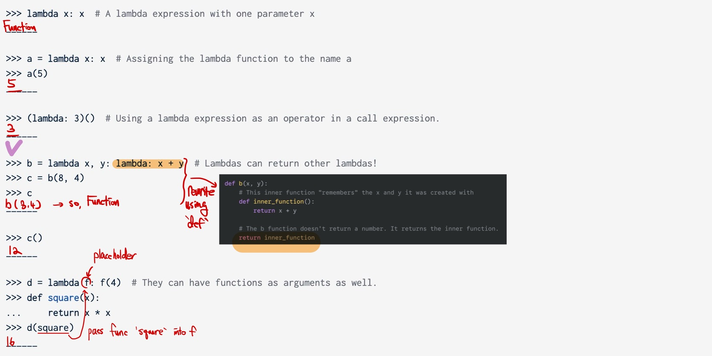

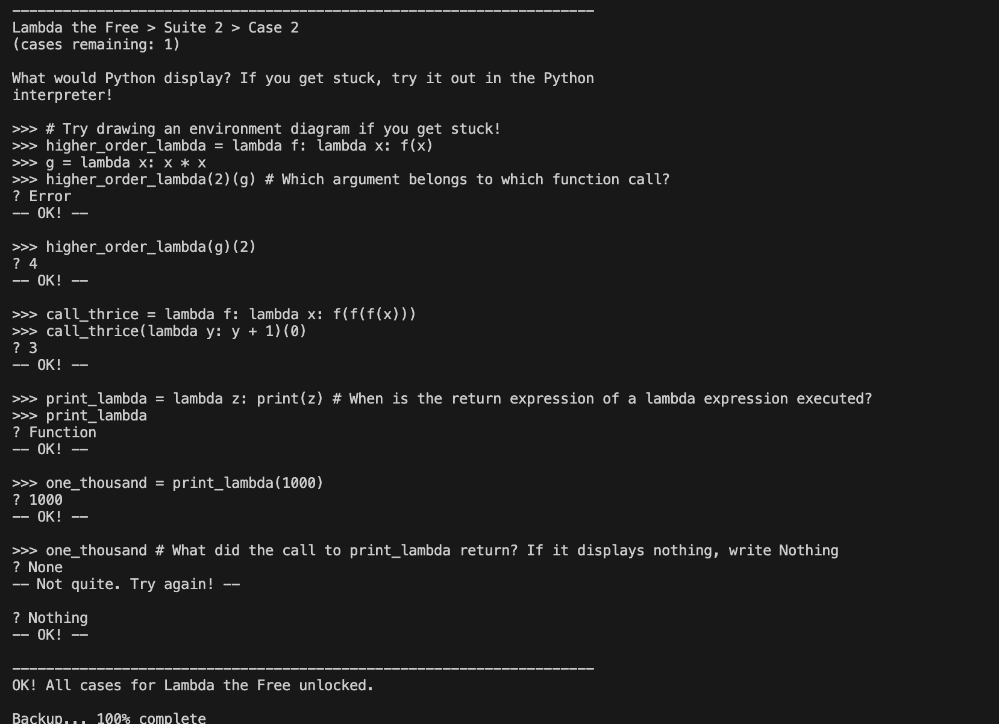

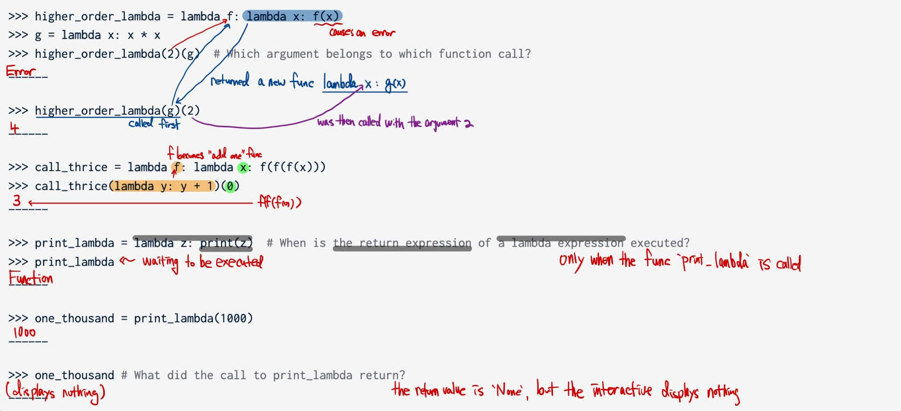

#### Q4: Composite Identity Function

```python
"""Write a function that takes in two single-argument functions, f and g, and returns another function that has a single parameter x. The returned function should return True if f(g(x)) is equal to g(f(x)) and False otherwise. You can assume the output of g(x) is a valid input for f and vice versa."""

def composite_identity(f, g):
    """
    Return a function with one parameter x that returns True if f(g(x)) is
    equal to g(f(x)). You can assume the result of g(x) is a valid input for f
    and vice versa.

    >>> add_one = lambda x: x + 1        # adds one to x
    >>> square = lambda x: x**2          # squares x [returns x^2]
    >>> b1 = composite_identity(square, add_one)
    >>> b1(0)                            # (0 + 1) ** 2 == 0 ** 2 + 1
    True
    >>> b1(4)                            # (4 + 1) ** 2 != 4 ** 2 + 1
    False
    """
    "*** YOUR CODE HERE ***"
    def h(x):
        return f(g(x)) == g(f(x))
    
    return h
```

doing the same thing, but using a `lambda` expression:

```python
def composite_identity(f, g):
    return lambda x: f(g(x)) == g(f(x))     # return h
```

#### Q5: Count Cond

```python
# Q5: Count Cond

def sum_digits(y):
    """Return the sum of the digits of non-negative integer y."""
    total = 0
    while y > 0:
        total, y = total + y % 10, y // 10
    return total

def is_prime(n):
    """Return whether positive integer n is prime."""
    if n == 1:
        return False
    k = 2
    while k < n:
        if n % k == 0:
            return False
        k += 1
    return True

def count_cond(condition):
    """Returns a function with one parameter N that counts all the numbers from
    1 to N that satisfy the two-argument predicate function Condition, where
    the first argument for Condition is N and the second argument is the
    number from 1 to N.

    >>> count_fives = count_cond(lambda n, i: sum_digits(n * i) == 5)
    >>> count_fives(10)   # 50 (10 * 5)
    1
    >>> count_fives(50)   # 50 (50 * 1), 500 (50 * 10), 1400 (50 * 28), 2300 (50 * 46)
    4

    >>> is_i_prime = lambda n, i: is_prime(i) # need to pass 2-argument function into count_cond
    >>> count_primes = count_cond(is_i_prime)
    >>> count_primes(2)    # 2
    1
    >>> count_primes(3)    # 2, 3
    2
    >>> count_primes(4)    # 2, 3
    2
    >>> count_primes(5)    # 2, 3, 5
    3
    >>> count_primes(20)   # 2, 3, 5, 7, 11, 13, 17, 19
    8
    """
    "*** YOUR CODE HERE ***"
    def counter(n):
        i =1
        count = 0
        while i <= n:
            if condition(n, i):
                count += 1
            i +=1
        return count
    return counter
```

This problem was asking me about **abstraction and generalization** with higher-order functions.

The thinking process was: 

1. find what's the same
2. find what's different
3. make the difference a parameter
4. and build a function that returns a function

#### Q6: HOF Diagram Practice

```python
"""Draw the environment diagram that results from executing the code below on paper or a whiteboard"""
n = 7

def f(x):
    n = 8
    return x + 1

def g(x):
    n = 9
    def h():
        return x + 1
    return h

def f(f, x):
    return f(x + n)

f = f(g, n)
g = (lambda y: y())(f)
```

#### Q7: Multiple

```python
"""Write a function that takes in two positive integers and returns the smallest positive integer that is a multiple of both."""

def multiple(a, b):
    """Return the smallest number n that is a multiple of both a and b. 

    >>> multiple(3, 4)
    12
    >>> multiple(14, 21)
    42
    """
    "*** YOUR CODE HERE ***"
    i = max(a, b)
    while True:
        if i % a == 0 and i % b == 0:
            return i
        else:
            i += 1
```

#### Q8: I Heard You Liked Functions...

```python
"""
Define a function cycle that takes in three functions f1, f2, and f3, as arguments. cycle will return another function g that should take in an integer argument n and return another function h. That final function h should take in an argument x and cycle through applying f1, f2, and f3 to x, depending on what n was. Here's what the final function h should do to x for a few values of n:

n = 0, return x
n = 1, apply f1 to x, or return f1(x)
n = 2, apply f1 to x and then f2 to the result of that, or return f2(f1(x))
n = 3, apply f1 to x, f2 to the result of applying f1, and then f3 to the result of applying f2, or f3(f2(f1(x)))
n = 4, start the cycle again applying f1, then f2, then f3, then f1 again, or f1(f3(f2(f1(x))))
And so forth.

"""

def cycle(f1, f2, f3):
    """Returns a function that is itself a higher-order function.

    >>> def add1(x):
    ...     return x + 1
    >>> def times2(x):
    ...     return x * 2
    >>> def add3(x):
    ...     return x + 3
    >>> my_cycle = cycle(add1, times2, add3)
    >>> identity = my_cycle(0)
    >>> identity(5)
    5
    >>> add_one_then_double = my_cycle(2)
    >>> add_one_then_double(1)
    4
    >>> do_all_functions = my_cycle(3)
    >>> do_all_functions(2)
    9
    >>> do_more_than_a_cycle = my_cycle(4)
    >>> do_more_than_a_cycle(2)
    10
    >>> do_two_cycles = my_cycle(6)
    >>> do_two_cycles(1)
    19
    """
    "*** YOUR CODE HERE ***"
    def g(n):
        def h(x):
            i = 0   # counter

            # when n = 0, since it's 0 < 0, loop doesn't execute so there's no problem
            while i < n:            # loop n times
                if i % 3 == 0:      # apply f1
                    x = f1(x)   
                elif i % 3 == 1:    # apply f2
                    x = f2(x)
                else:               # apply f3
                    x = f3(x)
                i += 1              # increment counter
            return x
        return h
    return g
```

<br />

### [HW 02: Higher-Order Functions](https://cs61a.org/hw/hw02/)

#### Q1: Product

```python
"""Write a function called product that returns the product of the first n terms of a sequence. Specifically, product takes in an integer n and term, a single-argument function that determines a sequence. (That is, term(i) gives the ith term of the sequence.) product(n, term) should return term(1) * ... * term(n)."""

def product(n, term):
    """Return the product of the first n terms in a sequence.

    n: a positive integer
    term: a function that takes an index as input and produces a term

    >>> product(3, identity)  # 1 * 2 * 3
    6
    >>> product(5, identity)  # 1 * 2 * 3 * 4 * 5
    120
    >>> product(3, square)    # 1^2 * 2^2 * 3^2
    36
    >>> product(5, square)    # 1^2 * 2^2 * 3^2 * 4^2 * 5^2
    14400
    >>> product(3, increment) # (1+1) * (2+1) * (3+1)
    24
    >>> product(3, triple)    # 1*3 * 2*3 * 3*3
    162
    """
    "*** YOUR CODE HERE ***"
    total = 1
    k = 1   # counter
    while k <= n:
        total *= term(k)
        k += 1
    return total
```

#### Q2: Accumulate

```python
def accumulate(fuse, start, n, term):
    """Return the result of fusing together the first n terms in a sequence 
    and start. The terms to be fused are term(1), term(2), ..., term(n). 
    The function fuse is a two-argument commutative & associative function.

    >>> accumulate(add, 0, 5, identity)  # 0 + 1 + 2 + 3 + 4 + 5
    15
    >>> accumulate(add, 11, 5, identity) # 11 + 1 + 2 + 3 + 4 + 5
    26
    >>> accumulate(add, 11, 0, identity) # 11 (fuse is never used)
    11
    >>> accumulate(add, 11, 3, square)   # 11 + 1^2 + 2^2 + 3^2
    25
    >>> accumulate(mul, 2, 3, square)    # 2 * 1^2 * 2^2 * 3^2
    72
    >>> # 2 + (1^2 + 1) + (2^2 + 1) + (3^2 + 1)
    >>> accumulate(lambda x, y: x + y + 1, 2, 3, square)
    19
    """
    "*** YOUR CODE HERE ***"
    total = start
    k = 1
    while k <= n:
        total = fuse(total, term(k))
        k += 1
    return total


def summation_using_accumulate(n, term):
    """Returns the sum: term(1) + ... + term(n), using accumulate.

    >>> summation_using_accumulate(5, square) # square(1) + square(2) + ... + square(4) + square(5)
    55
    >>> summation_using_accumulate(5, triple) # triple(1) + triple(2) + ... + triple(4) + triple(5)
    45
    >>> # This test checks that the body of the function is just a return statement.
    >>> import inspect, ast
    >>> [type(x).__name__ for x in ast.parse(inspect.getsource(summation_using_accumulate)).body[0].body]
    ['Expr', 'Return']
    """
    return accumulate(add, 0, n, term)


def product_using_accumulate(n, term):
    """Returns the product: term(1) * ... * term(n), using accumulate.

    >>> product_using_accumulate(4, square) # square(1) * square(2) * square(3) * square()
    576
    >>> product_using_accumulate(6, triple) # triple(1) * triple(2) * ... * triple(5) * triple(6)
    524880
    >>> # This test checks that the body of the function is just a return statement.
    >>> import inspect, ast
    >>> [type(x).__name__ for x in ast.parse(inspect.getsource(product_using_accumulate)).body[0].body]
    ['Expr', 'Return']
    """
    return accumulate(mul, 1, n, term)
```
- for addition, start with `0`
- for multiplication, start with `1`
- generalized two functions `summation_using_accumulate` and `product_using_accumulate` with `accumulate`

#### Q3: Make Repeater

```python
def make_repeater(f, n):
    """Returns the function that computes the nth application of f.

    >>> add_three = make_repeater(increment, 3)
    >>> add_three(5)
    8
    >>> make_repeater(triple, 5)(1) # 3 * (3 * (3 * (3 * (3 * 1))))
    243
    >>> make_repeater(square, 2)(5) # square(square(5))
    625
    >>> make_repeater(square, 3)(5) # square(square(square(5)))
    390625
    """
    "*** YOUR CODE HERE ***"
    def repeated(x):
        i = 1           # counter
        total = x
        while i <= n:
            total = f(total)
            i += 1
        return total
    return repeated     # returning functions
```

- defined a function `repeated` inside another and return it

<br />
<br />

## Wrapping Up

Know how to:
- pass functions as inputs
- return functions
- combine loops with function calls

<br />

I think these were the key take aways from this section.

That's it for Week2, and have a great day.

<br />
<br />

Thank you.


---
## References

[1] DeNero, J., Klein, D., & Abbeel, P. (2025). "Higher-Order Functions." In *Composing Programs*. Retrieved from https://www.composingprograms.com/pages/16-higher-order-functions.html

[2] Wikipedia contributors. (2025). "Newton's method." *Wikipedia, The Free Encyclopedia*. Retrieved from https://en.wikipedia.org/wiki/Newton%27s_method

[3] Cham. (n.d.). *Newton's Method Visualization* [Image]. Wikimedia Commons. Public Domain. Retrieved from https://commons.wikimedia.org/w/index.php?curid=17998452