# [CS 61A] Week 3

Hi, I'm Ju Ho Kim and thank you very much for taking your time to visit my website!

## A. Midterm1 Prep.

### Environment Diagram Examples

Two examples from Week 3 Discussion session:

1. 

```python
name = "Chris"
times = 2

def greet(name):
    def goodbye():
        text = "Bye"
        return text * times
        
    return goodbye() + " " + name
    
todo = greet
print(todo("Nicholas"))
```

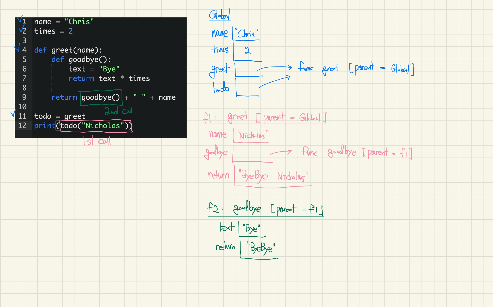

2. 

```python
def team(work):
    return t(work) - 1
def dream(work, s):
    if work(s - 2):
        t = not s
    return not t
work, t = 3, abs
team = dream(team, work + 1) and t
```

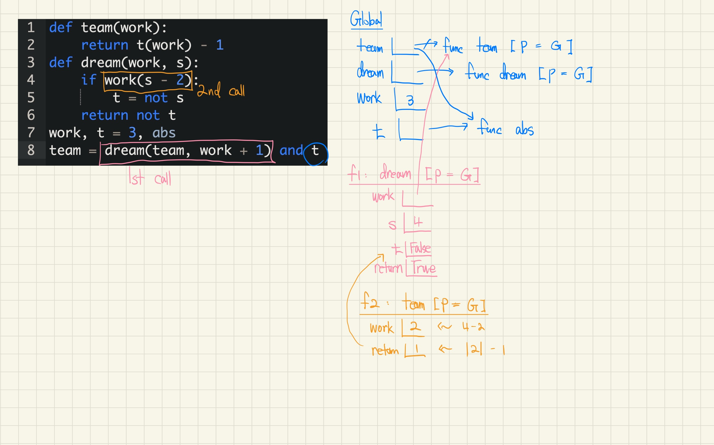

### Past Exam Review 1 (Fall 2022 Midterm1)

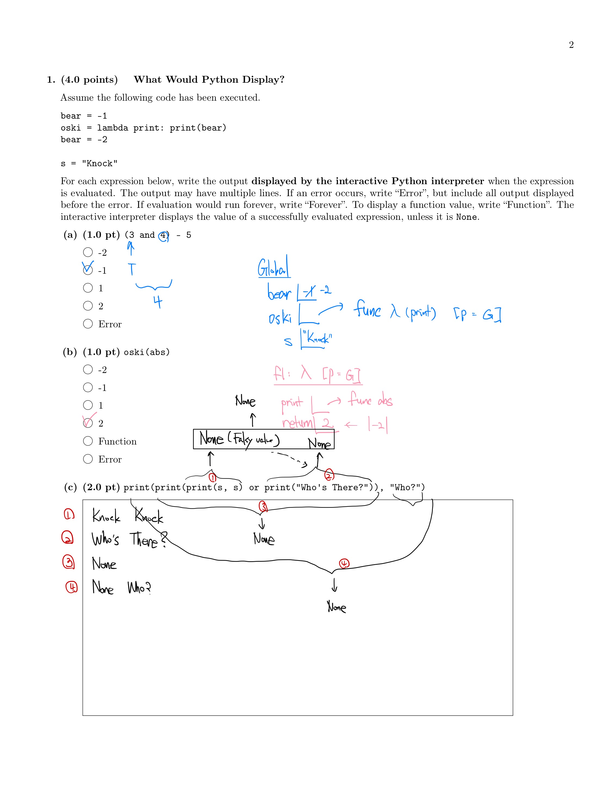

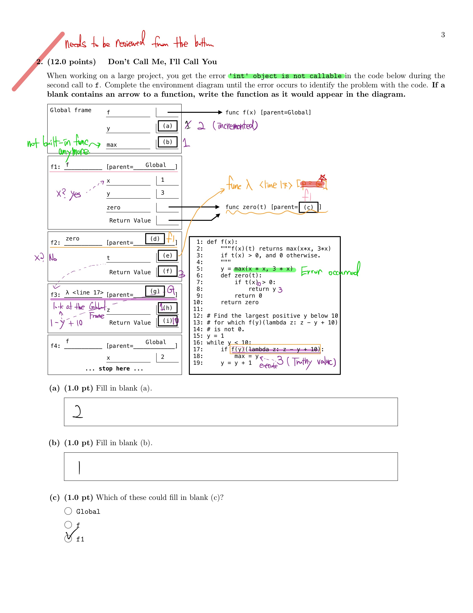

```python
def f(x):

    y = max(x * x, 3 * x)
    def zero(t):
        if t(x) > 0:
            return y
        return 0
    return zero

y = 1
while y < 10:
    if f(y)(lambda z: z - y + 10):
        max = y
    y = y + 1
```

- sequence for **Call Expressions** (`if f(y)(lambda z: z - y + 10):`)

1. evaluate the **operator** (in this case, `f(y)`) : must produce a function (in this case, get return value func `zero`)
2. then evaluate the **operand** (in this case, `(lambda z: z - y + 10)` which is still a function), from **left to right**
3. then apply func `zero` to that operand `(lambda z: z - y + 10)`

And,

> "Functions always inherit the frame in which **they are defined**, **NOT the frame in which they are called**"

In this problem, the reason why the parent of the `lambda` function is the **Global** frame is because it is located inside the `while` loop (which is in the Global environment), but not inside the body of `f` or `zero`.

At first, I thought it was f1, cuz right before the `lambda` function, the function `zero` just returned back to the `f(y)` whose [parent = f1]. But, as written above, function parents are decided at **definition time**, not at their **call time**

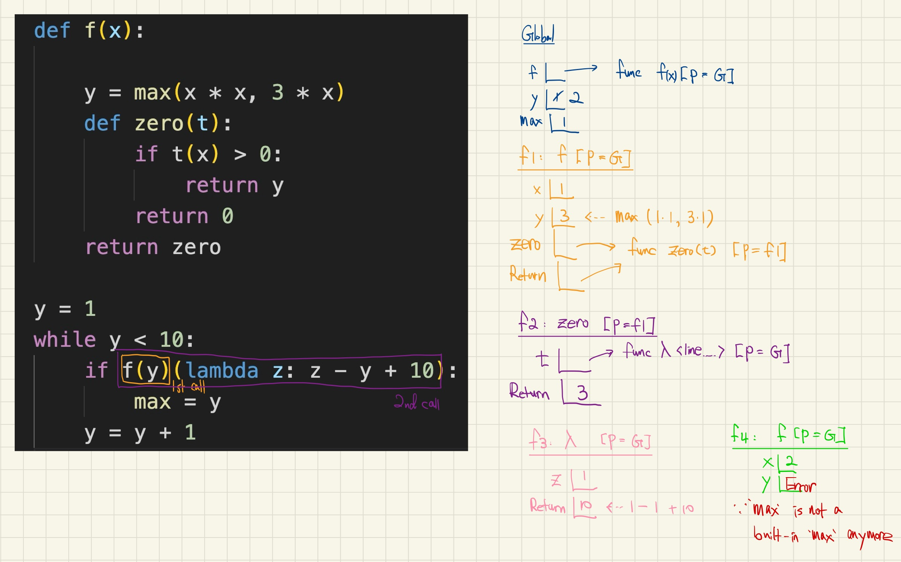

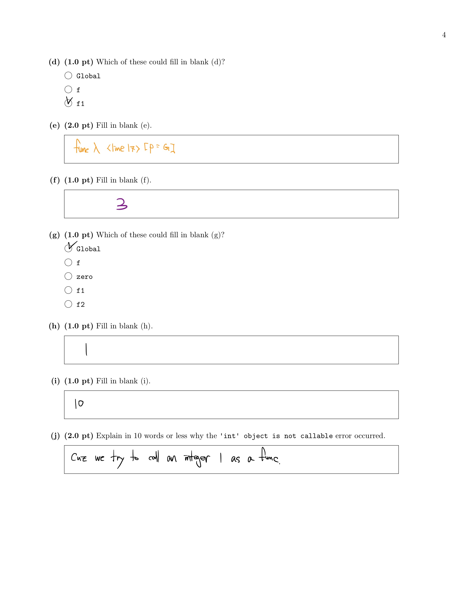

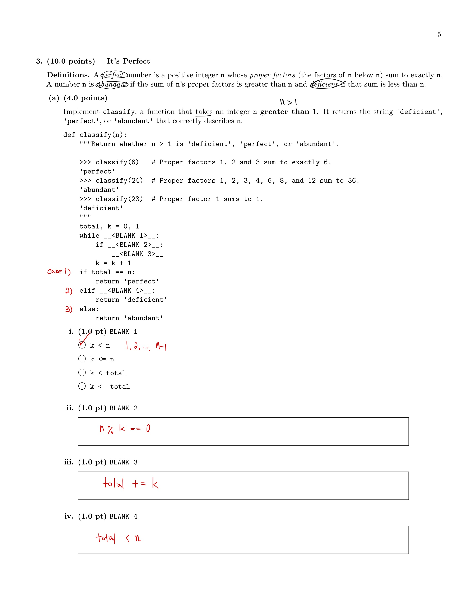

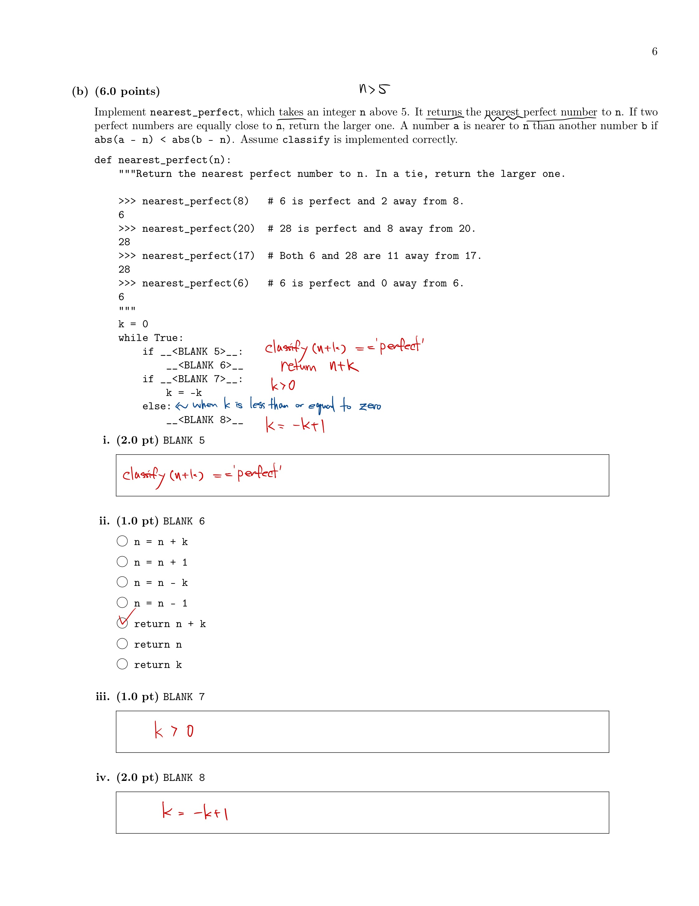

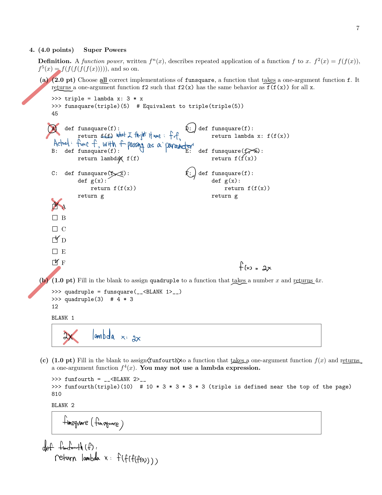

## B. Midterm1 Recap. (Fall 2025)


## Study Guide

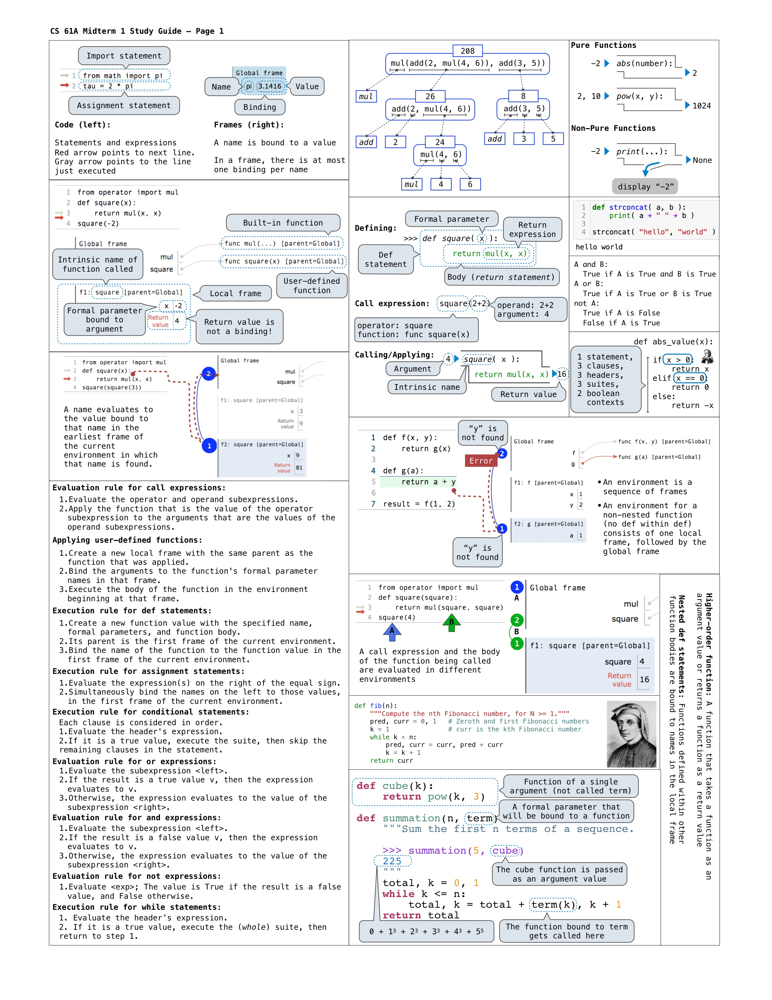

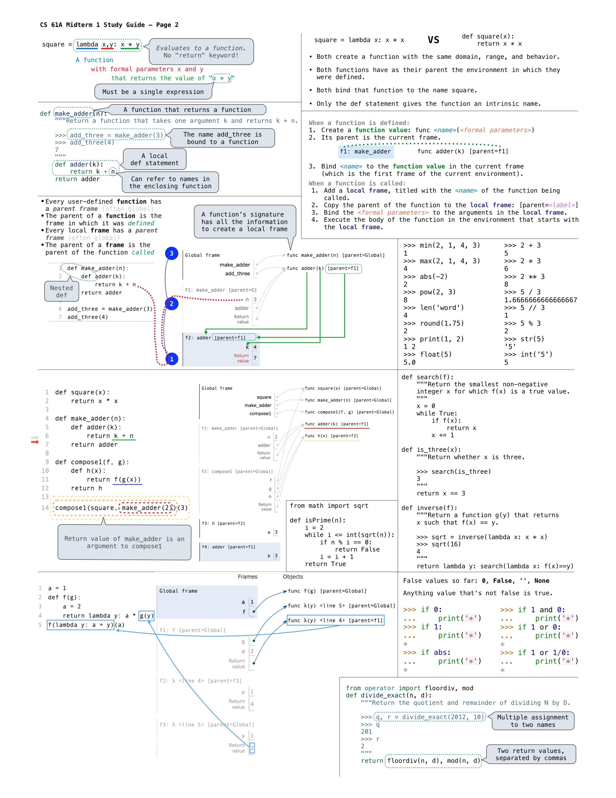
