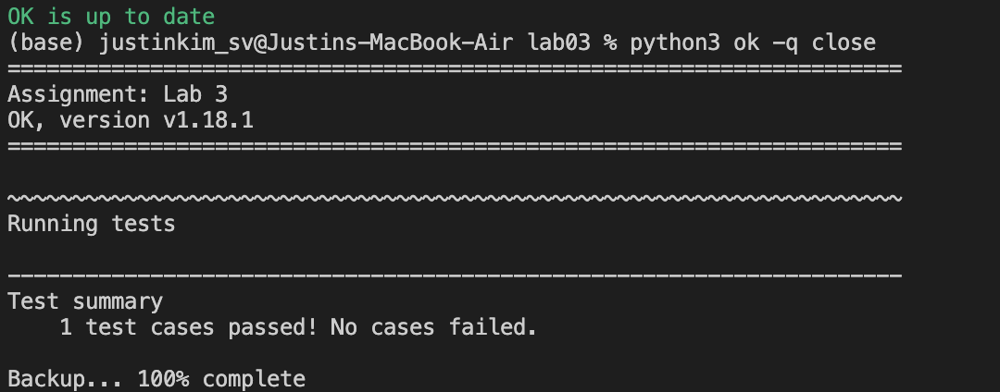
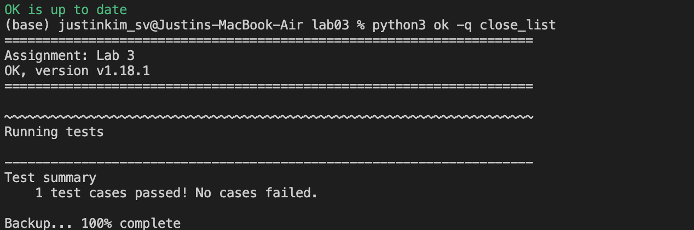

# Sequences, Containers, Data Abstraction

Hi, I'm Ju Ho Kim and thank you very much for taking your time to visit my website!

In Week5, we learned about **Sequences**, **Containers**, and **Data Abstraction**.

This post is class notes about what I learned this week to make it useful for reviewing before the upcoming exams.

<br />

---

## 1. Sequences (Sep 22nd, 2025)

### List Indexing

```python
x = [3, 1, [4, 1, [5, 2], 6, 5], 3, 5]
```

An expression to get the 2: `x[2][2][1]`

One thing that's useful with **list** is to get a single element out of the list.

### `for` loops

It's also useful to loop over all of the elements in a list.

### `range`

A range is a sequence of consecutive integers.

```python
>>> list(range(-2, 2))  # List constructor
[-2, -1, 0, 1]
>>> list(range(4))      # Range with a 0 starting value
[0, 1, 2, 3]
```

The `range` just keeps track of what the starting and ending values are.

But the reason that we use `range` is that it's a convenient way to get a bunch of integers in a row and it's also a more efficient way of storing those than to actually create the list.

### List Comprehensions

```python
>>> digits = [1, 8, 0, 8]

>>> [100 * d for d in digits]
[100, 800, 0, 800]

>>> [100 * d for d in digits if d < 5]
[100, 0]
```

```python
>>> numbers = range(10)
>>> even = [num for num in numbers if num % 2 == 0]
[0, 2, 4, 6, 8]
```

Two snippets below are working totally same but in different way:

Using a `for` loop:
```python
output = []         # create an empty list
for item in a:      # iterate through each item
    if condition:   # check a condition
        output.append(item * 2) # then append if `True`
```

Using a list comprehensions:
```python
[item * 2 for item in a if condition]
```

#### Example 1: Evens

```python
def evens(n: int) -> list[int]:
    """Return a list of the first n even numbers

    >>> evens(0)
    []
    >>> evens(3)
    [0, 2, 4]
    """
    return __________________
```

```python
    return [2 * i for i in range(n)]
```

Or we can also come up with an another way

```python
    return [i for i in range(n * 2) if i % 2 == 0]
```

<br />

#### Example 2: Two Lists

```python
"""
Given these two related lists of the same length:
`xs = list(range(-10, 11))`,
`ys = [x*x - 2*x + 1 for x in xs]`

Write a list comprehension that evaluates to:
A list of all the x values (from xs) for which the corresponding y (from ys) is below 10.
"""
____________________________________________
```

```python
[xs[i] for i in range(len(xs)) if ys[i] < 10]
```

This confused me during the class. The thing is, we always need to remember what we're even trying to do.

We want a **list of all the x values** for which the corresponding y is below ten. That's why it begins with `[xs[i]]`.

`for i in range(len(xs))`: this iterates through all of the indices of `xs`.

And we want it if the thing in `ys` at index `i` is less than ten. So, it's followed by `if ys[i] < 10`.

```python
>>> xs = list(range(-10, 11))
>>> ys = [x*x - 2*x + 1 for x in xs]
>>> [xs[i] for i in range(len(xs)) if ys[i] < 10]
[-2, -1, 0, 1, 2, 3, 4]
```

As shown above, these are the two ways that we're using to pull the elements out when we're writing list comprehensions:
1. we're going to walk through all of the elements in a list with something like `for x in xs` or
2. we're going to walk over all of the possible indices like `for i in range(len(xs))`

<br />

#### Example 3: Promoted

```python
"""
Implement `promoted`, which takes a sequence `s` and a one-argument function `f`. It returns a
list with the same elements as `s`, but with all elements `e` for which `f(e)` is a true value
ordered first. Among those placed first and those placed after, the order stays the same.
"""

def promoted(s, f):
    """Return a list with the same elements as s, but with all
    elements e for which f(e) is a true value placed first.
    >>> promoted(range(10), odd) # odds in front
    [1, 3, 5, 7, 9, 0, 2, 4, 6, 8]
    """
    # Hint: two list comprehensions
    return ____________
```

```python
    return [e for e in s if f(e)] + [e for e in s if not f(e)]
```

The boolean expression `not f(e)` is the same thing as saying only the things for which `f(e)` returned `False`.

### Slices & Recursion

> "Slices of lists are useful for making recursive calls"

For any list `s`, the expression `s[1:]` is called a **slice** from index 1 to the end. Just chopped off the 0th element of `s`, which is `s[0]`.

But, slicing  **does not** impact the original list.

```python
>>> s = [2, 3, 6, 4]
>>> s[1:]
[3, 6, 4]
>>> s
[2, 3, 6, 4]    # slicing `s` doesn't affect `s`
```

So, `s = s[0] + s[1:]`.

#### Slices & Recursion Example 1: Reverse

```python
# def reverse(s: list) -> list:
def reverse(s):
    """Return `s` in reverse order.

    >>> reverse([4, 6, 2])
    [2, 6, 4]
    """
    if not s:   # Note: The False value of a list is an empty list
        return []   # if the list `s` is empty, just return the empty list
    return _________
```

One way to do this is to reverse everything from the first element on and then take the thing that was formerly the first element and stick it at the end:

```python
    return reverse(s[1:]) + [s[0]]
```

Another way of writing this is the opposite of the first one we just did. Take the last thing and stick it on the beginning:

```python
    return [s[-1]] + reverse(s[:-1])
```

```python
# might get confused
reverse(s[1:])  # reverse elements including s[1]
reverse(s[:-1]) # reverse elements excluding s[-1]
```
<br />

#### Slices & Recursion Example 2: Max Product

Implement `max_product`, which takes a list of numbers and returns the maximum product that can be formed by multiplying together non-consecutive elements of the list. Assume that all numbers in the input list are greater than or equal to 1.

```python
def max_product(s):
    """Return the maximum product of non-consecutive elements of s.

    >>> max_product([10, 3, 1, 9, 2])   # 10 * 9
    90
    >>> max_product([5, 10, 5, 10, 5])  # 5 * 5 * 5
    125
    >>> max_product([])   # The product of no numbers is 1
    1
    """
    if s == []:
        return _________
    if len(s) == 1:
        return _________
    else:
        return _____(_________, _________)
```

```python
    if s == []:
        return 1
    if len(s) == 1:
        return s[0]
    else:   # Recursive step
        return max(s[0] * max_product(s[2:]), max_product(s[1:]))
```

In recursive step, we have a choice to make regarding the first element `s[0]`. We must return the max result from two paths.

- One path is to **include** `s[0]`, which simplifies the problem to finding `max_product(s[2:])`
- and another path is to **exclude** the `s[0]`, which simplifies the problem to finding `max_product(s[1:])`

<br />

#### Another Recursion example

- Implement sums(n, m), which takes a total n and maximum m. It returns a list of all lists:
    - that sum to n,
    - that contain only positive numbers up to m, and
    - in which no two adjacent numbers are the same.

- Two lists with the same numbers in a different order should both be returned.

```python
def sums(n, m):
    """Return lists that sum to n containing positive numbers up to 
    m that have no adjacent repeats.

    >>> sums(5, 1)
    []
    >>> sums(5, 2)
    [[2, 1, 2]]
    >>> sums(5, 3)
    [[1, 3, 1], [2, 1, 2], [2, 3], [3, 2]]
    >>> sums(5, 5)
    [[1, 3, 1], [1, 4], [2, 1, 2], [2, 3], [3, 2], [4, 1], [5]]
    """
    if n < 0:
        return []
    if n == 0:
        sums_to_zero = []     # Only way to sum to zero
        return [sums_to_zero] # List of all ways to sum to zero
    result = []
    for k in range(1, m + 1):
        result = result + [ ___ for rest in ___ if rest == [] or ___ ]
    return result
```

So here I need to complete the `sums(n, m)`. I'm looking for all lists of positive integers that sum up to `n`, where each integer is at most `m`, and the key constraint is that **no two adjacent nums can be the same**. Order matters, meaning lists [1, 2] and [2, 1] are distinct.

Since I am exploring all possible lists that lead to a total `n`, a **recursive backtracking approach** is the most desired fit. I'll make a choice (the first num `k`), reduce the problem size, and recurse. When I saw this problem at first, I struggled to find a way to combine the `k` with the recursive solutions in the given list comprehensive format.

I have the loop `for k in range(1, m + 1):`, and I know I need to build the `result` list. I kept getting stuck on what exactly fills these blanks.

I need to keep reminding that **recursion is about simplifying**. So let's simplify. Say that I selected a `k`, then I need to think *what is the new, smaller problem* that I need to solve to find the rest of the list. The new total is not `n` anymore, it's `n - k`, but the max num remains `m`. So, the necessary recursive call is `sums(n - k, m)`. That goes into the second blank.

Now, I need to append the selected `k` into a list `rest`. In order to combine them into a list, I need `[k] + rest`, which is what goes into the first blank.

Now, the only remaining task is the constraint "**no two adjacent nums can be the same**". In the `if` condition, I'm checking if I can put the `k` next to the list `rest`. I must know which single num in `rest` must be checked against `k`. It must be the first element `rest[0]` for sure. Because that's the num adjacent to `k`. They must not be equal, so `rest[0] != k` is the condition that should be in the thrid blank. When we look at the line, since a case `rest == []` is already handled, the entire line is completed. (**IMPORTANT**: We can't swap the things in the `or` clause.)

**Base cases** are already provided in the skeleton. But, let's make sure the stopping conditions are correctly established there. 1) If `n == 0`, we've found a valid list. So, we should return a list containing a single empty list which is `[[]]`. 2) If `n < 0`, that path is invalid, so return an empty list `[]`.

```python
    for k in range(1, m + 1):
        result = result + [ [k] + rest for rest in sum(n - k, m) if rest == [] or rest[0] != k ]
    return result
```


<br />
<br />

## 2. Containers (Sep 24th, 2025)

### List review 

Again, the Reverse example:

```python
# def reverse(s: list) -> list:
def reverse(s):
    """Return `s` in reverse order.

    >>> reverse([4, 6, 2])
    [2, 6, 4]
    """
    if not s:   # Note: The False value of a list is an empty list
        return []   # if the list `s` is empty, just return the empty list
    return reverse(s[1:]) + [s[0]]
```

From the three options below, which correctly reverse?

- (A) `reverse(s[1:] + [s[0]])`
    - For (A), the problem is that we're passing the entire list `s[1:] + [s[0]]` into reverse. If we look at the doctest, we would call reverse a `[4, 6, 2]`, and then (A) would call reverse again with a list that has `[6, 2, 4]`. We've still got a list with three elements. So, (A) is **going to run forever** because it's just going to keep reorganizing the elements within `s`. So the problem is that the last element `[s[0]]` should be outside the parentheses. It should be outside the call to reverse because we want to stick it on to the end only after we've reversed everything else.
- (B) `[s[-1 * i] for i in range(len(s))]`
    - If you see something like this, I think the thing that's really helpful is to just start walking through an example. Let's take the example again: `reverse([4, 6, 2])`. We'll start with `i = 0`, and so the first element in our list (B) will be `s[-1 * 0]` which is `s[0]`. So the first thing on the list (B) will be that `4`, and we know we don't want four to be the first thing. We wanted them to be in reverse order.
- (C) `[s[-x + 1] for x in range(reverse(s))]`
    - One warning sign here is that the function signature `def reverse(s):` said `reverse(s)` and we've also got the same call `reverse(s)` in (C) to reverse `s`, so that's a sign that our code is going to run forever because we haven't made any progress. Also, even if there was something that returned to `reverse(s)` at some point, we're taking the range of a list `range(reverse(s))`, and the argument that `range` takes is a number, an integer, like the length of the list, so this code would also error there. So, basically option (C) has a bunch of problems.

So, (A), (B), and (C) none of 'em work at all.

### Box-and-Pointer Notation

```python
def f(s):
    x = s[0]
    return [x]

t = [3, [2 + 2, 5]]
u = [f(t[1]), t]
print(u)
```


> Print Output: `[[4], [3, [4, 5]]]`

### example: Double-Eights with a List

Implement `double_eights`, which takes a list `s` and returns whether two consecutive items are both 8.

- VERSION 1: Using positions (indices)

```python
def double_eights(s):
    """Return whether two consecutive items of list s are 8.
    
    >>> double_eights([1, 2, 8, 8])
    True
    >>> double_eights([8, 8, 0])
    True
    >>> double_eights([5, 3, 8, 8, 3, 5])
    True
    >>> double_eights([2, 8, 4, 6, 8, 2])
    False
    """
    for _______________________:
        if ___________________________:
            return True
    return False
```

The thing that I think is easiest to start with is to think about the case when we want to return `True`. We can fill the second blank in with something like `s[i] == 8 and s[i + 1] == 8`. This is going to check if there's two things next to each other that are both eight. We've got to write a `for` loop. We definitely want to start at the beginning, but we've got to be careful not to go off the end of the list. If we end up at the last index, we're going to check to see if the thing `s[last index]` is the same thing with `s[last index + 1]`, then it'll cause an error.

So, the way that we write the `for` loop is to write for `i` in range of `len(s) - 1`. This keeps us from falling off the the end. `i in range(len(s) - 1)`.

```python
    for i in range(len(s) - 1):
        if s[i] == 8 and s[i + 1] == 8:
            return True
    return False
```

But, what if `s` is an empty list? If `s` is an empty list, we would do `range(0 - 1)` which is `range(-1)`. We need to know what happens if we do `range(-1)`.

```python
>>> list (range(-1))
[]
```

Because Python tries to make a range starting from 0 going up to -1, and then it doesn't find anything, `list (range(-1))` gives us an empty list `[]`. So this does still work.

- VERSION 2: Using slices

```python
def double_eights(s):
    """Return whether two consecutive items of list s are 8.
    
    >>> double_eights([1, 2, 8, 8])
    True
    >>> double_eights([8, 8, 0])
    True
    >>> double_eights([5, 3, 8, 8, 3, 5])
    True
    >>> double_eights([2, 8, 4, 6, 8, 2])
    False
    """
    if _____ == [____]:
        return True
    elif len(s) < 2:
        return False
    else:
        return ___________________
```

The idea of this version is going to be that we're going to try and find that chunk of the list where there's those two 8s next to each other. One of hint in the structure here is that there's no loop in the structure. The fact that there's **no loop** is a good hint that we're gonna need to write some **recursive call** somewhere in order to keep checking the rest of the list.

First thing is something that we're gonna check for when we return `True` and the thing that we can check is the same as we did in VERSION1, just expressed differently.

`if s[:2] == [8, 8]:` >> We're checking if the first two things in the list `s` are 8. If that matches, then we return `True`.

If `len(s) < 2`, then there's definitely not an 88 left, so we can return `False`.

In the last blank, where we need to make a recursive call, we're gonna check to see if the rest of `s` has any double 8s in it. >> `double_eights(s[1:])`

```python
    if s[:2] == [8, 8]:
        return True
    elif len(s) < 2:
        return False
    else:
        return double_eights(s[1:])
```

Shouldn't we have this check `elif len(s) < 2` first to see if the length is less than two? Slices don't return an error, they just return an empty list `[]`. On the other hand, in general, list indexing is not generous. It'll give us an error, but slicing will just return an empty list, without returning an error.

### Processing Container values

#### Aggregation

Built-in functions take iterable arguments and aggregate them into a value:

1. `sum(iterable[, start]) -> value`

```python
>>> sum(range(3))
3   # 0 + 1 + 2

>>> sum(range(3), 100)
103 # 100 + 0 + 1 + 2
```

```python
def cube(k):
    return pow(k, 3)

def summation(n, term):
    """Sum the first n terms of a sequence.

    >>> summation(5, cube)
    225  # 1 + 8 + 27 + 64 + 125
    """
    total, k = 0, 1
    while k <= n:
        total, k = total + term(k), k + 1
    return total
```

Let's rewrite `summation` to be much more concise using a aggregation func `sum`.

```python
def summation2(n, term):
    return sum([term(x) for x in range(1, n + 1)])
```

`[term(x) for x in range(1, n + 1)]`: We've got a list comprehension here. The way that we create this list is we call term on `x` for every `x` in `range(1, n + 1)`. So the first thing that we want in this `range` is `1`. The last thing that we want in the `range` is `n`. So that's why we pass an argument `n + 1` because the last argument in `range` always tells us where to stop. We stop at one before that one.

2. `max(iterable[, key = func]) -> value` and `max(a, b, c, ...[, key = func]) -> value`

```python
midterm_grades = [['Amy', 28], ['John', 35], ['Kay', 14], ['Apollo', 31]]

>>> midterm_grades
[['Amy', 28], ['John', 35], ['Kay', 14], ['Apollo', 31]]

>>> max(midterm_grades, key = lambda x: x[1])
['John', 35]
```

```python
>>> max(range(3))
2
>>> max(0, 1, 2, 3, 4)
4
```

3. `all(iterable) -> bool`

Return `True` if bool(x) is `True` for **all** values x in the iterable.

#### Example

> Definition: A *prefix sum* of a sequence of numbers is the sum of the first n elements for some positive length n.

```python
"""Implement `prefix`, which takes a list of numbers `s` and returns a list of the prefix sums of `s` in increasing order of the length of the prefix."""

def prefix(s):
    """Return a list of all prefix sums of list s.

    >>> prefix([1, 2, 3, 0, 4, 5])
    [1, 3, 6, 6, 10, 15]
    >>> prefix([2, 2, 2, 0, -5, 5])
    [2, 4, 6, 6, 1, 6]
    """
    return [______________ for k in _____________]
```

In the first blank of the expression, we want to add more and more things into our sum. What we can do is `k` can be an index in `range(len(s))`. So, `k` will go 0, 1, 2, 3, ... .

And the thing we would like to sum up is everything that includes `s[k]` and that's why the second argument to slice should be `k+1`. >> `sum(s[:k + 1])`, the `sum` says we're gonna sum up everything in `s` up until `k + 1`. So, here, what we should do is to check if those first and last things on the list look good.

```Python
    return [sum(s[:k + 1]) for k in range(len(s))]
```

Also, we could do this example recursively.

#### example: All Possible Sums

```python
def sums(n: int) -> list[list[int]]:
    """Return a list of all of the possible lists of positive integers whose elements add up to n.

    >>> sums(3)
    [[1, 1, 1], [1, 2], [2, 1], [3]]
    """
    result = []
    for first in range(1, n):
        result += ____________________________________________
    return result + [[n]]
```

Let's trace through what's happening in that `for` loop. When we do `for first in range(1, n):`, we're deciding what could be the first number in our list. For `n = 3`, that gives us 1 and 2 as possible first numbers.

Here's where the recursive thinking kicks in. Let's say I pick `1`, then I need all the ways to make the remaining sum, which is `n - first`, or `3 - 1` = 2. So for each possible first number, I create a new list that starts with that first number, followed by each possible way to make the remaining sum.

So, the blank should be filled with `[[first] + rest for rest in sums(n - first)]`.

Verify:
- If `first = 1`, then `sums(3 - 1) = sums(2)` gives us `[[1, 1], [2]]`. So we get `[1] + [1, 1] = [1, 1, 1]` and `[1] + [2] = [1, 2]`.
- If `first = 2`, then `sums(3 - 2) = sums(1)` gives us `[[1]]`. So we get `[2] + [1] = [2, 1]`.
- Finally, we add `[n]` at the end to handle the case where the entire sum is just one number.

```python
    result = []
    for first in range(1, n):
        result += [[first] + rest for rest in sums(n - first)]
    return result + [[n]]
```


<br />
<br />

## 3. Data Abstraction (Sep 26th, 2025)

(to be updated)

---

## Assignments

### Lab 03: Recursion, Python Lists

#### Q1: WWPD: Lists & Ranges


#### Q2: Print If

Implement `print_if`, which takes a list `s` and a one-argument function `f`. It prints each element `x` of `s` for which `f(x)` returns a true value.

```python
# --------------------------
# Q2: Print If
def print_if(s, f):
    """Print each element of s for which f returns a true value.

    >>> print_if([3, 4, 5, 6], lambda x: x > 4)
    5
    6
    >>> result = print_if([3, 4, 5, 6], lambda x: x % 2 == 0)
    4
    6
    >>> print(result)  # print_if should return None
    None
    """
    for x in s:
        "*** YOUR CODE HERE ***"
        if f(x):
            print(x)
```


#### Q3: Close

Implement `close`, which takes a list of integers `s` and a non-negative integer `k`. It returns how many of the elements of `s` are within `k` of their index. That is, the absolute value of the difference between the element and its index is less than or equal to `k`. (Remember that list is "zero-indexed"; the index of the first element is `0`.)

```python
# --------------------------
# Q3: Close
def close(s: list[int], k: int) -> int:
    """Return how many elements of s are within k of their index.

    >>> t = [6, 2, 4, 3, 5]
    >>> close(t, 0)  # Only 3 is equal to its index
    1
    >>> close(t, 1)  # 2, 3, and 5 are within 1 of their index
    3
    >>> close(t, 2)  # 2, 3, 4, and 5 are all within 2 of their index
    4
    >>> close(list(range(10)), 0)
    10
    """
    assert k >= 0
    count = 0
    for i in range(len(s)):  # Use a range to loop over indices
        "*** YOUR CODE HERE ***"
        if abs(s[i] - i) <= k:
            count += 1
    return count
```



#### Q4: WWPD: List Comprehensions


#### Q5: Close List

Implement `close_list`, which takes a list of integers `s` and a non-negative integer `k`. It returns a list of the elements of `s` that are within `k` of their index. That is, the absolute value of the difference between the element and its index is less than or equal to `k`.

```python
# Q5: Close List
def close_list(s: list[int], k: int) -> list[int]:
    """Return a list of the elements of s that are within k of their index.

    >>> t = [6, 2, 4, 3, 5]
    >>> close_list(t, 0)  # Only 3 is equal to its index
    [3]
    >>> close_list(t, 1)  # 2, 3, and 5 are within 1 of their index
    [2, 3, 5]
    >>> close_list(t, 2)  # 2, 3, 4, and 5 are all within 2 of their index
    [2, 4, 3, 5]
    """
    assert k >= 0
    return [s[i] for i in range(len(s)) if abs(s[i] - i) <= k]
```



#### Q6: Squares Only

Implement the function `squares`, which takes in a list of positive integers. It returns a list that contains the square roots of the elements of the original list that are perfect squares. Use a list comprehension. (To find if `x` is a perfect square, you can check if `sqrt(x)` equals `round(sqrt(x))`.)

```python
# Q6: Squares Only
from math import sqrt

def squares(s: list[int]) -> list[int]:
    """Returns a new list containing square roots of the elements of the
    original list that are perfect squares.

    >>> seq = [8, 49, 8, 9, 2, 1, 100, 102]
    >>> squares(seq)
    [7, 3, 1, 10]
    >>> seq = [500, 30]
    >>> squares(seq)
    []
    """
    return [int(sqrt(n)) for n in s if sqrt(n) == round(sqrt(n))]
            # the reason why I use `int()` is to convert float `sqrt(n)` to integers
```


#### Q7: Double Eights

Write a recursive function that takes in a positive integer `n` and determines if its digits contain two adjacent `8`s (that is, two `8`s right next to each other).

```python
# Q7: Double Eights
def double_eights(n: int) -> bool:
    """Returns whether or not n has two digits in row that
    are the number 8.

    >>> double_eights(1288)
    True
    >>> double_eights(880)
    True
    >>> double_eights(538835)
    True
    >>> double_eights(284682)
    False
    >>> double_eights(588138)
    True
    >>> double_eights(78)
    False
    >>> # ban iteration
    >>> from construct_check import check
    >>> check(SOURCE_FILE, 'double_eights', ['While', 'For'])
    True
    """
    "*** YOUR CODE HERE ***"
    # Base Case: if n is a single digit or less to contain "88", we need to stop
    if n < 10:
        return False
    # check the last two digits (using % 100) for the '88' pattern
    elif n % 100 == 88:
        return True
    # Recursive Step: remove the last digit then check the rest of the number
    else:
        return double_eights(n // 10)
```


#### Q8: Making Onions

Write a function `make_onion` that takes in two one-argument functions, `f` and `g`. It returns a function that takes in three arguments: `x`, `y`, and `limit`. The returned function returns `True` if it is possible to reach `y` from `x` using up to `limit` calls to `f` and `g`, and `False` otherwise. For example, if `f` adds 1 and `g` doubles, then it is possible to reach 25 from 5 in four calls: `f(g(g(f(5))))`.

```python
# Q8: Making Onions
def make_onion(f, g):
    """Return a function can_reach(x, y, limit) that returns
    whether some call expression containing only f, g, and x with
    up to limit calls will give the result y.

    >>> up = lambda x: x + 1
    >>> double = lambda y: y * 2
    >>> can_reach = make_onion(up, double)
    >>> can_reach(5, 25, 4)      # 25 = up(double(double(up(5))))
    True
    >>> can_reach(5, 25, 3)      # Not possible
    False
    >>> can_reach(1, 1, 0)      # 1 = 1
    True
    >>> add_ing = lambda x: x + "ing"
    >>> add_end = lambda y: y + "end"
    >>> can_reach_string = make_onion(add_ing, add_end)
    >>> can_reach_string("cry", "crying", 1)      # "crying" = add_ing("cry")
    True
    >>> can_reach_string("un", "unending", 3)     # "unending" = add_ing(add_end("un"))
    True
    >>> can_reach_string("peach", "folding", 4)   # Not possible
    False
    """
    def can_reach(x, y, limit):
        if limit < 0:
            return False
        elif x == y:
            return True
        else:
            return can_reach(f(x), y, limit - 1) or can_reach(g(x), y, limit - 1)
    return can_reach
```


---

## References

[1] J. DeNero, D. Klein, P. Abbeel, "2.3 Sequences," in *Composing Programs*. [Online]. Available: https://www.composingprograms.com/pages/23-sequences.html. Accessed: Sep. 26, 2025. (Originally published 2016)