# Trees, Mutability, Iterators

Hi, I'm Ju Ho Kim and thank you very much for taking your time to visit my website!

<br />

In Week6, we learned about **Trees**, **Mutability**, and **Iterators**.

This post is study notes about what I learned this week to make it useful for reviewing.

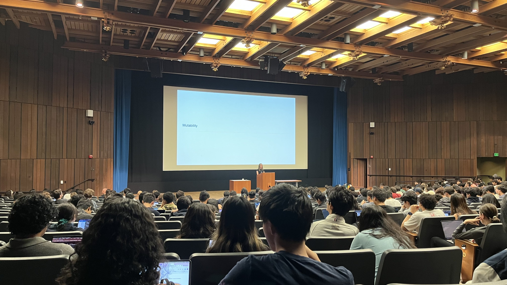

<br />

---

## 1. Trees

> "The core idea behind **tree recursion** is to make a really small choice, and then for each of those choices recurse."

For a lot of other problems, it's gonna be helpful to think about what is the smallest choice that I can possibly make before punting the rest of the work to another recursive call.

### Understanding Functional Tree Abstraction

The fundamental idea here is **Data Abstraction**.

A tree is defined not by how it's actually stored (which is a list of lists), but by the functions we use to interact with it.

This **abstraction barrier** means we don't care about the implementation. We only use the provided functions.

The two most important functions that define the structure of a tree `t` are:
- `label(t)`: This returns the **label** at the root of the tree.
- `branches(t)`: This returns **a list of sub-trees** that are immediately connected to the root. The items in this list are themselves trees.

We also have helper functions:
- `tree(label, branches)`: This is the **constructor** that builds a new tree.
- `is_leaf(t)`: This returns `True` if a tree `t` has no branches (i.e., `branches(t)` returns an empty list)

```python
t1=tree(3,[tree(4),tree(5,[tree(6),tree(7)])])
```

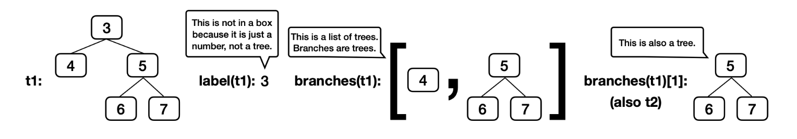

another one:
```python
t = tree(1,
        [tree(9, [
            tree(2, [
                tree(5, [
                    tree(6),
                    tree(7)]),
                tree(8),
                tree(3)]),
            tree(4)])])
```

```python
#                    1
#                    |
#                    9
#                   / \
#                  2   4
#                 /|\
#                5 8 3
#               / \
#              6   7
```

<br />

### Before Writing Recursive Functions:

- What **small, initial choice** can I make?
    - for trees, often: which branch to explore?

- What **recursive call for each option**?

- How can you **combine the results** of those recursive calls?
    - what type of values do they return?
    - what do the possible return values mean?
    - how can you use those return values to complete your implementation? e.g.,
        - look to see if any option evaluated to `True`
        - add up the results from each option

### example: Largest label

goal: Look for the largest label in a tree.

So, before spend too much time looking at the code, it's useful to do the process above.

- **Small, Initial choice**: (as with most tree problems, we're gonna decide) Which branch to look for the largest label on

- **Recursive Call for each option**: For each branch `b`, `largest_label(b)`

- **Combine results**: Return the largest of these, **AND** the root label

skeleton code:
```python
def largest_label(t):
    """Return the largest label in tree t."""
    if is_leaf(t):
        return _____
    else:
        return _____([__________ for b in branches(t)] + __________)
```

First, ignore the base case and just look at the recursive case:

```python
        return _____([__________ for b in branches(t)] + __________)
```

For each `b` in `branches(t)`, we're gonna find the largest label >> `largest_label(b)` in the second blank

Then we need to find the `max` of all of those biggest labels >> `max` in the first one

, and the label of this tree. >> `[label(t)]` for the last blank

```python
        return max([largest_label(b) for b in branches(t)] + [label(t)])
```

Now move on to the base case, where we say that if `t` is a leaf, then we know we don't want to get any further and we can just return the label of `t` >>> `label(t)` is the answer for the base case

```python
    if is_leaf(t):
        return label(t)
```

<br />

### example: Above Root

Implement a function called `above_root`.

goal: to print all of the labels of `t` that are larger than the root label.

skeleton code:
```python
def above_root(t):
    """Print all the labels of t that are larger than the root label."""
    def process(u):
        if __________:
            print(__________)
        for b in branches(__):
            process(b)
    process(t)
```

Again, the same process:

- **Small, Initial choice**: Which branch to look at for labels to print 

- **Recursive Call for each option**: For each branch `b`, call `process(b)` on that branch

- **Combine results**:  **Don't** need to combine the recursive return call!
                        **Do** need to print this label, if it's larger than the root.

let's translate that into code.


if the label is bigger than the `label(t)`, which is the tree that we started with, then we would like to print the `label(u)`:
```python
        if label(u) > label(t):
            print(label(u))
```

So here `process(u)` is processing some subtree within this tree `u`, and it's printing out the label of that subtree if it's larger than initial tree `t`.

> okay so **When is it necessary to have a helper function inside a recursive call?**

In this case, we need the helper function `process(u)` cuz we need to keep track of two things at the same time.

Here, we need to keep track of where we are in the tree like where's the spot that we're exploring. But we also need to keep track of that root label because we need to compare everything to it to see if things are bigger than the root label.

So that's why we can't just write our recursive call on `above_root(t)` here.

```python
        for b in branches(__):
            process(b)
```

here we need to decide what thing we need to look for each of the branches of btw `t` and `u`.

```python
        for b in branches(u):
            process(b)
```

We need to look at the `branches(u)`, which is just the part of the tree `u`. If in this call we were looking at the `branches(t)`, we would just keep doing the same work again and again and again where we would look at all of the roots branches and we would never go further down in the tree.

## Discussion 05: Trees

### Q1: Warm Up

Find the value of `result`:

```python
result = label(min(branches(max([t1, t2], key=label)), key=label))
```

We need to work from the innermost part of the expression outward.

#### `max([t1, t2], key=label)`

The `key` function tells `max` which property of the items in the list to compare.

The property we are comparing here is the `label`.
- `label(t1)`: 3
- `label(t2)`: 5

So,
```python
max([t1, t2], key=label)    # returns `t2`
```

Substitute that result back into the main expression:
```python
result = label(min(branches(t2), key=label))
```

#### `branches(t2)`

- `t2` is tree `tree(5,[tree(6),tree(7)])`
- `branches(t2)` is the list of its sub-trees: `[tree(6),tree(7)]`

Substitute that result back in:
```python
result = label(min([tree(6),tree(7)], key=label))
```

#### `min([tree(6),tree(7)], key=label)`

Now, we're minimizing over the list, again using the `label` as the key.

`6` and `7` are the labels of the two trees in the list.

So,

```python
min([tree(6),tree(7)], key=label)   # returns `tree(6)`
```

Substitute that result back in:
```python
result = label(tree(6))
```

#### label(tree(6))

- Final value of `result`: 6


<br />

### Q2: Has Path (recursion on trees)

Skeleton Code:
```python
def has_path(t, p):
    """Return whether tree t has a path from the root with labels p.

    >>> t2 = tree(5, [tree(6), tree(7)])
    >>> t1 = tree(3, [tree(4), t2])
    >>> has_path(t1, [5, 6])        # This path is not from the root of t1
    False
    >>> has_path(t2, [5, 6])        # This path is from the root of t2
    True
    >>> has_path(t1, [3, 5])        # This path does not go to a leaf, but that's ok
    True
    >>> has_path(t1, [3, 5, 6])     # This path goes to a leaf
    True
    >>> has_path(t1, [3, 4, 5, 6])  # There is no path with these labels
    False
    """
    if p == ____:  # when len(p) is 1
        return True
    elif label(t) != ____:
        return False
    else:
        "*** YOUR CODE HERE ***"
```

For tree recursion problems, there are three things we need to care about:
- **Recursive Step**
- **Failure Base Case**
- **Success Base Case**

#### Recursive Step: breaking down the problem

Assume it's not a base case yet.

1. **check the current label**: The very first thing we must check is whether `label(t)` matches the first label we are looking for, `p[0]`. If it doesn't match, we immediately fail (that's one of our Failure Base Cases).

2. **propagate the problem**: If `label(t)` does match `p[0]`, it means the path starts correctly here. Now, the rest of the problem is:
- Do any of the branches, `b` (from `branches(t)`), contain a path that matches the rest of the path list, `p[1:]`? This is the point where we need to make a recursive call `has_path(b,p[1:])`.

```python
    else:
        "*** YOUR CODE HERE ***"
        for b in branches(t):
            if has_path(b, p[1:]):  # check if any branch has the rest of the path
                return True         # if one succeeds, then we're done
        return False                # if the loop finishes w/o finding a path
```

- Another way to write the `else` statement:
    - using a list comprehension
    - `any` returns `True` if at least 1 element in the list is Truthy

```python
    else:
        "*** YOUR CODE HERE ***"
        return any([has_path(b, p[1:]) for b in branches(t)])
```

#### Failure Base Case:

```python
    # The current node's label doesn't match the path's next label.
    elif label(t) != p[0]:
        return False
```

#### Success Base Case:

```python
    # We've matched everything in the path list.
    # remember, `p` is a list
    if p == [label(t)]:  # when len(p) is 1
        return True
```

The complete implementation:
```python
def has_path(t, p):
    # Success Base Case
    if p == [label(t)]:
        return True
    
    # Failure Base Case
    elif label(t) != p[0]:
        return False
        
    # Recursive Step
    else:
        for b in branches(t):
            if has_path(b, p[1:]):
                return True
        return False
```

### Q3: Find Path

The goal of `find_path(t, x)` is to return a list of labels from the root of `t` down to the node labeled `x`. If `x` isn't in the tree, we return `None`.

Skeleton:
```python
def find_path(t, x):
    """
    >>> t2 = tree(5, [tree(6), tree(7)])
    >>> t1 = tree(3, [tree(4), t2])
    >>> find_path(t1, 5)
    [3, 5]
    >>> find_path(t1, 4)
    [3, 4]
    >>> find_path(t1, 6)
    [3, 5, 6]
    >>> find_path(t2, 6)
    [5, 6]
    >>> print(find_path(t1, 2))
    None
    """
    if _______________________________________:
        return _______________________________________
    _______________________________________:
        path = _______________________________________
        if path:
            return _______________________________________
    return None
```

We want to loop through all branches
```python
    for b in branches(t):
```

Make the recursive call on each branch
```python
    for b in branches(t):
        path = find_path(b, x)
```

If there exists a path, we're going to add our current label of the node to the path
```python
    for b in branches(t):
        path = find_path(b, x)
        if path:
            return [label(t)] + path
```

For our **base case**, if we meet the condition, we're just gonna return the label in a list
```python
    if label(t) == x:
        return [label(t)]
```

The complete implementation:
```python
def find_path(t, x):
    # if _______________________________________:
    if label(t) == x:
        # return _______________________________________
        return [label(t)]
    # _______________________________________:
    for b in branches(t):
        # path = _______________________________________
        path = find_path(b, x)
        if path:
            # return _______________________________________
            return [label(t)] + path
    return None
```

<br />

### Q4: Only Paths

The goal of `only_paths(t, n)` is to return a new tree containing only the nodes of `t` that are on a path from the root to a leaf whose labels sum up to `n`. If no such path exists, it returns `None`.

Skeleton:
```python
def only_paths(t, n):
    """Return a tree with only the nodes of t along paths from the root to a leaf of t
    for which the node labels of the path sum to n. If no paths sum to n, return None.

    >>> print_tree(only_paths(tree(5, [tree(2), tree(1, [tree(2)]), tree(1, [tree(1)])]), 7))
    5
      2
      1
        1
    >>> t = tree(3, [tree(4), tree(1, [tree(3, [tree(2)]), tree(2, [tree(1)]), tree(5), tree(3)])])
    >>> print_tree(only_paths(t, 7))
    3
      4
      1
        2
          1
        3
    >>> print_tree(only_paths(t, 9))
    3
      1
        3
          2
        5
    >>> print(only_paths(t, 3))
    None
    """
    if ____:
        return t
    new_branches = [____ for b in branches(t)]
    if ____(new_branches):
        return tree(label(t), [b for b in new_branches if ____])
```

For **recursive call**, we're basically including the node. If so, we are `label(t)` closer to our sum. 
```python
    # new_branches = [____ for b in branches(t)]
    new_branches = [only_paths(b, n - label(t)) for b in branches(t)]
```

We want to ensure that:
1. We have reached the sum(n): `n` == `label(t)`
2. We have reached a leaf: `is_leaf(t)`
```python
    # if ____:
    if n == label(t) and is_leaf(t):
```

We're saying that if as long as one of our new branches has a path, then we want to return a new tree. If not, we're just gonna return `None`.
```python
    # if ____(new_branches):
    if any(new_branches):
```

Something crucial here is if we're iterating over `new_branches`, we only want to include branches that are **not** `None`.
```python
    if any(new_branches):
        # return tree(label(t), [b for b in new_branches if ____])
        return tree(label(t), [b for b in new_branches if b is not None])
```

The complete implementation:
```python
def only_paths(t, n):
    if n == label(t) and is_leaf(t):
        return t
    new_branches = [only_paths(b, n - label(t)) for b in branches(t)]
    if any(new_branches):
        return tree(label(t), [b for b in new_branches if b is not None])
```

<br />
<br />

## 2. Mutability

> "**Mutation** is a word that's used whenever there is a change to an object."

| Create a new list | Modify a list |
|:-:|:-:|
| **list literal**: `s = [1, 2, 3]` | `s.append(4)` |
| **list constructor**: `t = list(s)` | `s[1] = 4` |
| **list comprehension**: `u = [x for x in s]` | `s.extend(t)` # modifies `s` but not `t` |
| **Plus(+)**: `v = s + t` | `s.remove(2)` # removes the value `2` (first occurrence) |
| **slicing**: `w = t[1:]` | `s.pop()` # removes the last element and returns it |

```python
>>> x = [1, 2, 3]
>>> y = [4, 5]
```

```python
>>> x.extend(y)
# takes **every** element in `y` and sticks it onto the end of `x`
>>> x
[1, 2, 3, 4, 5]
```

```python
>>> x.append(y)
# takes **one** arguement in `y` and makes **one** new element and sticks it onto the end of `x`
>>> x
[1, 2, 3, 4, 5, [4, 5]]
```

```python
# Reversing
>>> s = [4, 8, 10, 12, 14]

# 1
>>> v = [s[-(i + 1)] for i in range(len(s))]
>>> v
[14, 12, 10, 8, 4]

# 2
>>> for i in range(len(s) // 2):
...     s[i], s[-(i + 1)] = s[-(i + 1)], s[i]
>>> s
[14, 12, 10, 8, 4]
```

In the second(`#2`) method, the reason why I used `len(s) // 2` is that we don't want to go all the way to the end of list `s`, we only want to go halfway there because we only want to swap halfway through.

### Lists are mutable, while Integers are immutable

#### example 1:
```python
x = [1, 2]
y = 3
s = [x, y, 4, 5]

x.append(6)
x[0] = 0
x = [7, 8]  # makes a NEW list
y = 9
print(s)
```

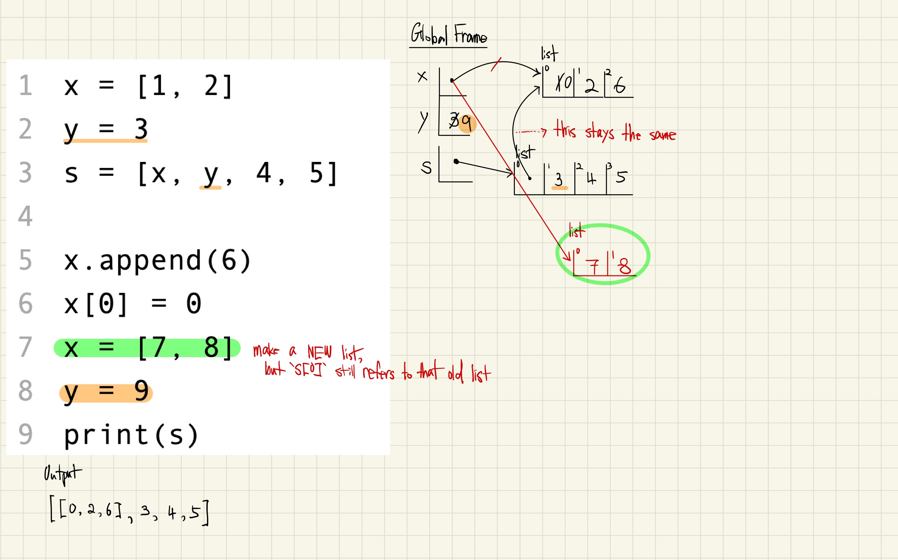

On line 2, we evaluated `y` to `3` and then stuck the `3` in the list `s`. That means that when we change `y` (line 8), it does not change anything about the list `s`.

<br />

#### example 2:
```python
y = 3
s = [[1, 2], y, 4, 5]
x = s[0]

s[0].append(6)
print(x)
print(s)
```

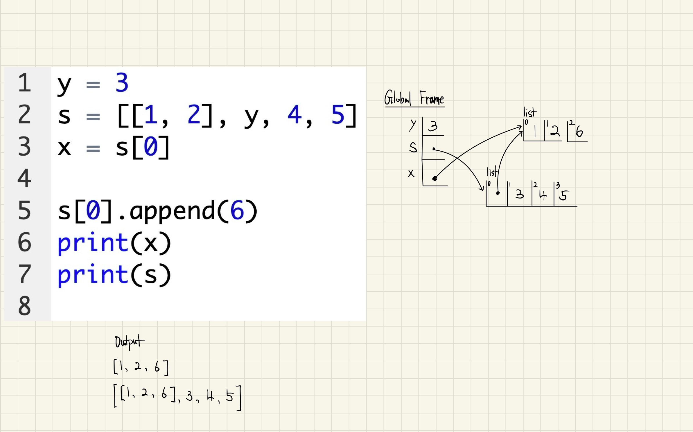

Again, even if I change the value of `y` after line 2, it won't cause any change to `s[1]`.

- Lists(**Mutable**) vs. Integers(**Immutable**)

<br />

#### example 3:
```python
s = [[1, 2], 3]
t = s[0]
s[0][1] = 4

s.append(t)
t.append(5)

print(s)
```

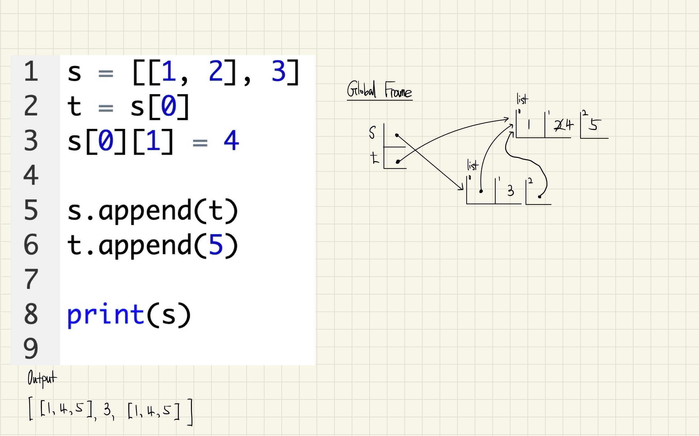

<br />

#### example 4:
```python
s = [[1, 2], 3]
t = s[0]
s[0][1] = 4

s.extend(t) # not `append`
t.append(5)

print(s)
```

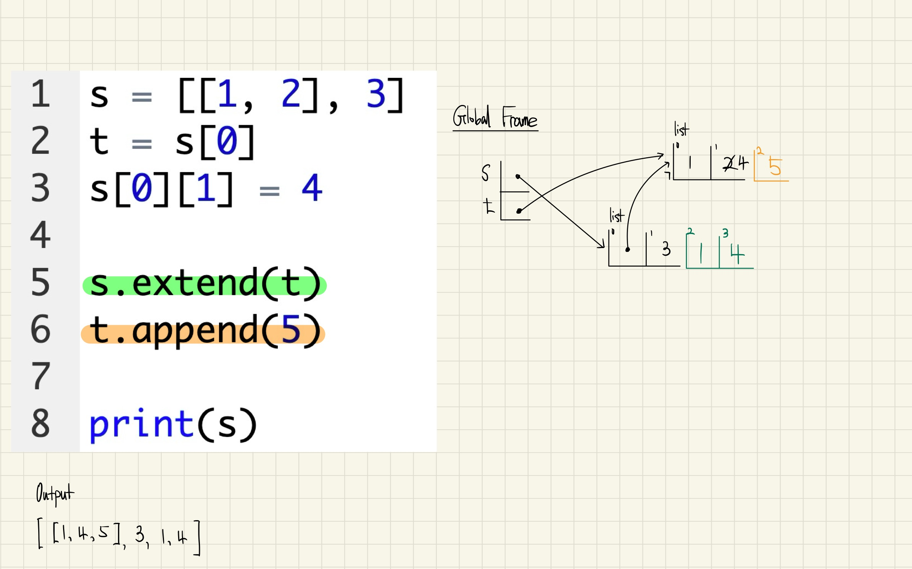

On line 4 here, we're gonna take each of the things out of `t` and put them on the end of `s`.

That means that when we append `5` to `t`, we are only changing the list of `t`.

So the end of `s` is still only `1` and `4`. Because when we did `s.extend(t)`, we changed `s`, but we did not change `t`.

<br />

#### example 5:
```python
s = [1, 2, 3]
t = [[4, 5], [6, 7]]

s.extend(t)
t[0][0] = 400

print(s)
```

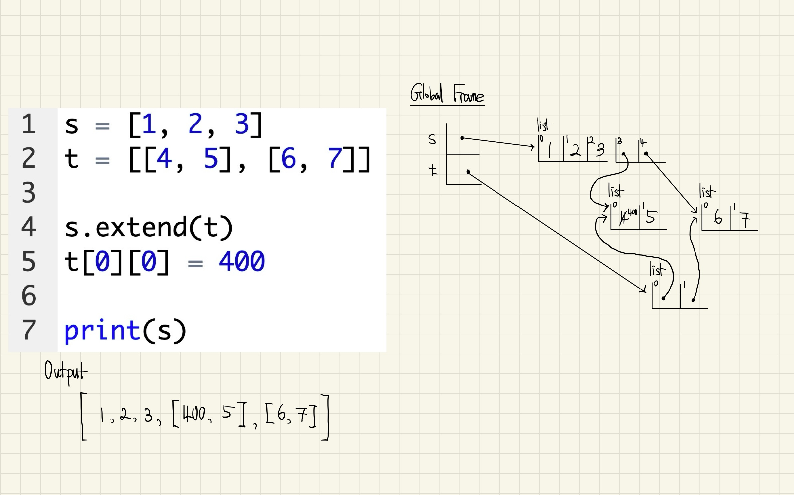

<br />

### Identitiy Operators (`is` or `==`)

- `is` evaluates to `True` if both expressions evaluate to the **same object**
- `==` evaluates to `True` if both expressions evaluate to **equal values**

```python
>>> s = [[1, 2], 3]
>>> t = s[0]

>>> s[0] is t
True

>>> s[0] is list(t)
False   # the list constructor `list()` creates a new list. So it's not the same object.
>>> s[0] == list(t)
True

>>> s[0] is [1, 2]
False   # they have equal values, but they are not the same list
```

#### Example: Sum more Fun (Building Lists with Append)

Refer to the other example ([Sum Fun](https://www.juho-kim.com/posts/06-cs61a-week5/#example-3-sum-fun)) I wrote in my fifth note in the "Sequences" section

Skeleton code:
```python
def sums(n, m):
    """Return lists that sum to `n` containing positive numbers up to `m` that have no adjacent repeats, for n > 0 and m > 0.

    >>> sums(5, 1)
    []
    >>> sums(5, 2)
    [[2, 1, 2]]
    >>> sums(5, 3)
    [[1, 3, 1], [2, 1, 2], [2, 3], [3, 2]]
    >>> sums(5, 5)
    [[1, 3, 1], [1, 4], [2, 1, 2], [2, 3], [3, 2], [4, 1], [5]]
    """
    result = []
    for k in range(1, _________):   # k is the first number of a list
        for rest in _________:
            if rest[0] != k:
                result.append(_________)    # build a list out of k and rest
    if n <= m:
        result.append([n])
    return result
```

```python
    result = []
    for k in range(1, _________):   # k is the first number of a list
```

`k` represents the first num of the list. Then I need to think about what the max value of `k` should be.

`k` can't be larger than `m` cuz we're only allowed to use nums up to `m`. So the upper bound needs to be `m + 1` for the `range`. But also `k` should be at most `n`. Therefore, I need `min(n, m) + 1` here (`range` is exclusive on the right).

```python
    result = []
    for k in range(1, min(n, m) + 1):   # k is the first number of a list
        for rest in _________:
```

Now I need to figure out what goes in the `for` loop. I need to generate all the possible ways to build the `rest` of the list. Since I've already used `k` as the first element, I need to find ways to sum to `n - k` now. I need a recursive call `sums(n - k, m)`. The target sum becomes `n - k` because I've already accounted for `k`, and I'm still allowed to use numbers up to `m`.

```python
    result = []
    for k in range(1, min(n, m) + 1):   # k is the first number of a list
        for rest in sums(n - k, m):
            if rest[0] != k:
                result.append(_________)    # build a list out of k and rest
```

Now I need to figure out what to append to `result`.

I have `k`, which is my first element, and I have rest, which is a complete list that sums to `n - k`. I need to combine them into a single list. To do this, I need `[k] +rest`.

The complete implementation:
```python
def sums(n, m):
    result = []
    for k in range(1, min(n, m) + 1):   # k is the first number of a list
        for rest in sums(n - k, m):
            if rest[0] != k:
                result.append([k] +rest)    # build a list out of k and rest
        if n <= m:  # recursion terminator
        result.append([n])
    return result
```

<br />
<br />

## 3. Iterators

(to be updated)

<br />
<br />

---

## Assignments

### Lab 4: Tree Recursion, Data Abstraction

#### Q1: Dictionaries

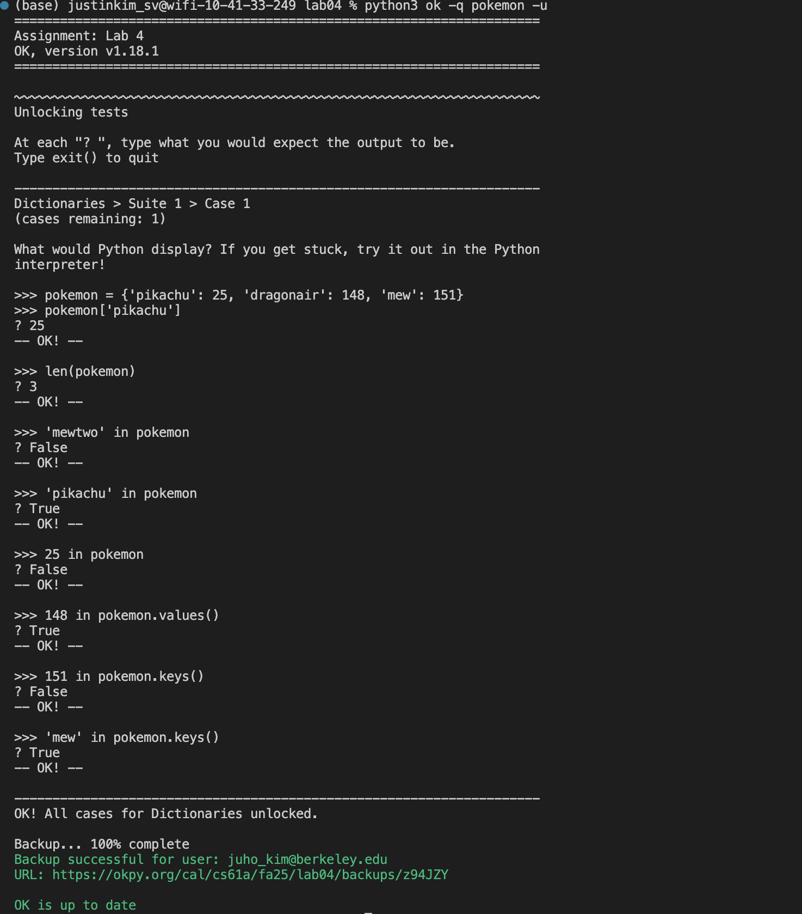

#### Q2: Divide

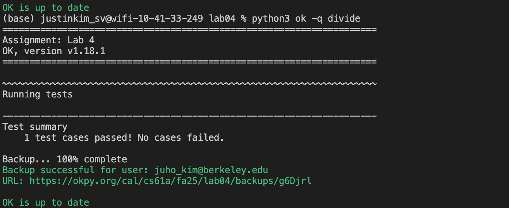

#### Q4: Buying Fruit

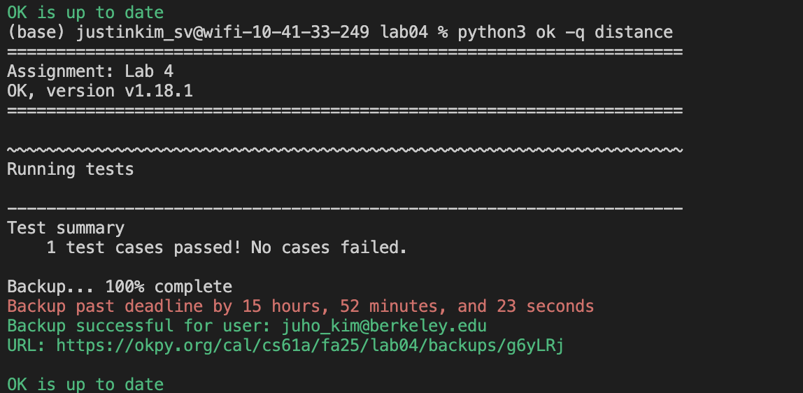

#### Q4: Distance


#### Q5: Closer City

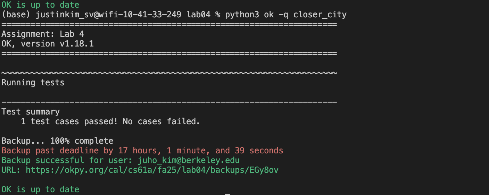

<br />

---

### Lab 5: Mutability, Iterators

#### Q1: WWPD: List-Mutation

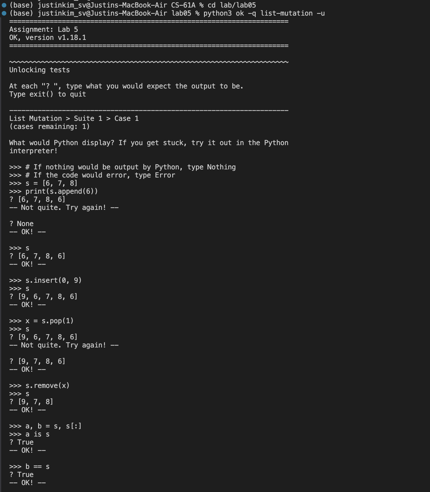

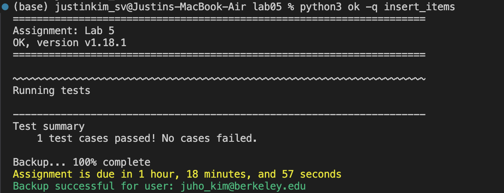

#### Q2: Insert Items

```python
# ---------------------------
# Q2: Insert Items
def insert_items(s: list[int], before: int, after: int) -> list[int]:
    """Insert after into s following each occurrence of before and then return s.

    >>> test_s = [1, 5, 8, 5, 2, 3]
    >>> new_s = insert_items(test_s, 5, 7)
    >>> new_s
    [1, 5, 7, 8, 5, 7, 2, 3]
    >>> test_s
    [1, 5, 7, 8, 5, 7, 2, 3]
    >>> new_s is test_s
    True
    >>> double_s = [1, 2, 1, 2, 3, 3]
    >>> double_s = insert_items(double_s, 3, 4)
    >>> double_s
    [1, 2, 1, 2, 3, 4, 3, 4]
    >>> large_s = [1, 4, 8]
    >>> large_s2 = insert_items(large_s, 4, 4)
    >>> large_s2
    [1, 4, 4, 8]
    >>> large_s3 = insert_items(large_s2, 4, 6)
    >>> large_s3
    [1, 4, 6, 4, 6, 8]
    >>> large_s3 is large_s
    True
    """
    "*** YOUR CODE HERE ***"
    for i in range(len(s) - 1, -1, -1):
        if s[i] == before:
            s.insert(i + 1, after)
    return s
```


#### Q3: Group By

```python
# ---------------------------
# Q3: Group By
def group_by(s: list[int], fn) -> dict[int, list[int]]:
    """Return a dictionary of lists that together contain the elements of s.
    The key for each list is the value that fn returns when called on any of the
    values of that list.

    >>> group_by([12, 23, 14, 45], lambda p: p // 10)
    {1: [12, 14], 2: [23], 4: [45]}
    >>> group_by(range(-3, 4), lambda x: x * x)
    {9: [-3, 3], 4: [-2, 2], 1: [-1, 1], 0: [0]}
    """
    grouped = {}
    for element in s:
        key = fn(element)
        if key in grouped:
            grouped[key].append(element)
        else:
            grouped[key] = [element]
    return grouped
```

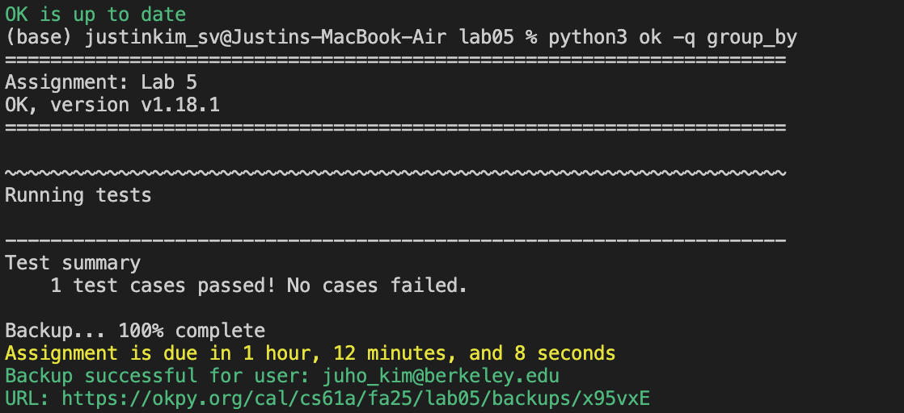

#### Q4: WWPD: Iterators

.png)

.png)

key takeaways from q4:
- Lists are **NOT** iterators - need to call `iter()` first
- Each `iter()` call creates a **NEW** iterator
- Iterators are consumed - once used, they can't restart
- Multiple variables can point to the **SAME** iterator - they share state
- `map()`, `filter()`, `zip()` return **iterators**, not lists

#### Q5: Count Occurrences

```python
# ---------------------------
# Q5: Count Occurrences
from typing import Iterator # "t: Iterator[int]" means t is an iterator that yields integers
def count_occurrences(t: Iterator[int], n: int, x: int) -> int:
    """Return the number of times that x is equal to one of the
    first n elements of iterator t.

    >>> s = iter([10, 9, 10, 9, 9, 10, 8, 8, 8, 7])
    >>> count_occurrences(s, 10, 9)
    3
    >>> t = iter([10, 9, 10, 9, 9, 10, 8, 8, 8, 7])
    >>> count_occurrences(t, 3, 10)
    2
    >>> u = iter([3, 2, 2, 2, 1, 2, 1, 4, 4, 5, 5, 5])
    >>> count_occurrences(u, 1, 3)  # Only iterate over 3
    1
    >>> count_occurrences(u, 3, 2)  # Only iterate over 2, 2, 2
    3
    >>> list(u)                     # Ensure that the iterator has advanced the right amount
    [1, 2, 1, 4, 4, 5, 5, 5]
    >>> v = iter([4, 1, 6, 6, 7, 7, 6, 6, 2, 2, 2, 5])
    >>> count_occurrences(v, 6, 6)
    2
    """
    "*** YOUR CODE HERE ***"
    count = 0
    for _ in range(n):
        if next(t) == x:
            count += 1
    return count
```

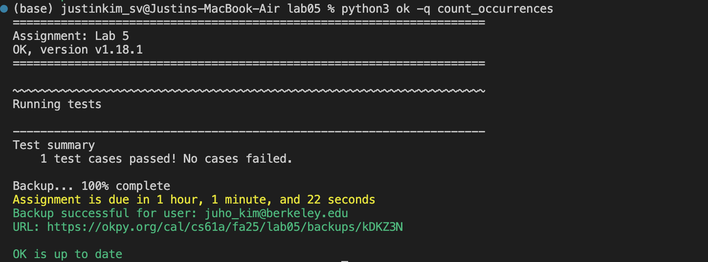

#### Q6: Repeated

```python
# ---------------------------
# Q6: Repeated
from typing import Iterator # "t: Iterator[int]" means t is an iterator that yields integers
def repeated(t: Iterator[int], k: int) -> int:
    """Return the first value in iterator t that appears k times in a row,
    calling next on t as few times as possible.

    >>> s = iter([10, 9, 10, 9, 9, 10, 8, 8, 8, 7])
    >>> repeated(s, 2)
    9
    >>> t = iter([10, 9, 10, 9, 9, 10, 8, 8, 8, 7])
    >>> repeated(t, 3)
    8
    >>> u = iter([3, 2, 2, 2, 1, 2, 1, 4, 4, 5, 5, 5])
    >>> repeated(u, 3)
    2
    >>> repeated(u, 3)
    5
    >>> v = iter([4, 1, 6, 6, 7, 7, 8, 8, 2, 2, 2, 5])
    >>> repeated(v, 3)
    2
    """
    assert k > 1
    "*** YOUR CODE HERE ***"
    count = 1
    prev = next(t)

    while count < k:
        current = next(t)
        if current == prev:
            count += 1
        else:
            count = 1
            prev = current
    return prev
```

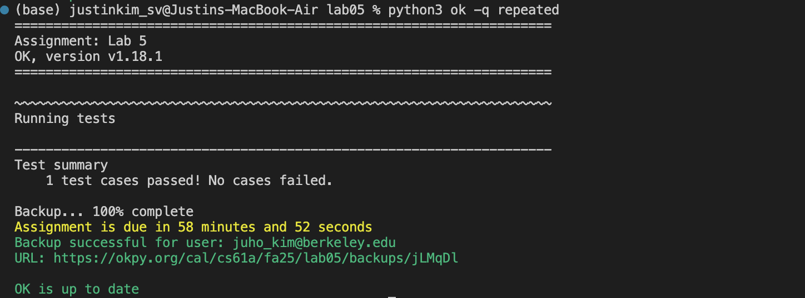

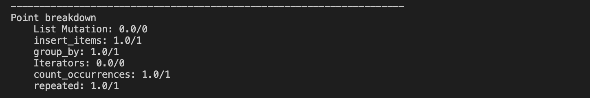

---

## Wrapping up

Honestly, I'm still struggling with "Trees", so I need to spend way more time figuring that out.

<br />
<br />

Thank you.


---

## References

[1] J. DeNero, D. Klein, P. Abbeel, "2.3 Sequences," in *Composing Programs*. [Online]. Available: https://www.composingprograms.com/pages/23-sequences.html. Accessed: Oct. 3rd, 2025. (Originally published 2016)