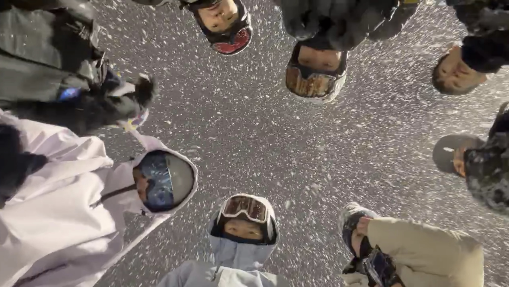

# Came back to Berkeley, after winter break

I just got back to Berkeley after winter break.

I was only out of my dorm for 17 days, but somehow managed to hop across three cities with my friends. We went to Vancouver, then Hokkaido, and lastly Gangwon-do back home in Korea 🇰🇷.

Honestly, I’ve never traveled to this many places in such a short amount of time in my entire life.

 

 

My friends kept joking that I was on a 장원영급 schedule.

 

So! Fun's over, and it's time to lock in.

This semester, I'll be interning at [Lawrence Berkeley National Laboratory](https://www.lbl.gov/) as a data science intern.

Of course, there'll be new challenges, but I hope to enjoy the process while pushing myself.

I’ve never taken a single day here for granted.

And I want to remember why I started this journey.

I’ll be back with a new post.

Happy new year, 
Ju Ho Kim