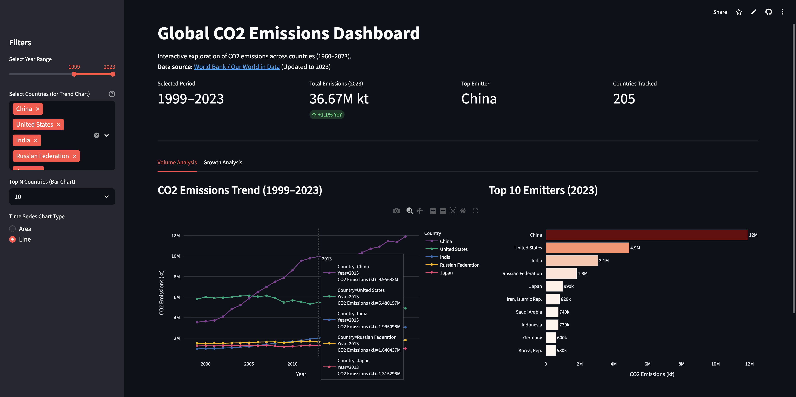

# Global CO2 Emissions Dashboard

**Interactive data visualization dashboard** that explores **64 years of global CO2 emissions** (1960-2023) across 205 countries, featuring volume analysis, growth rate tracking, and dynamic filtering—deployed live on Streamlit Cloud.

## Dashboard Preview

- [Live Demo](https://global-co2-insight-by-ju-ho-kim.streamlit.app)
- [GitHub Repository](https://github.com/jurinho17-sv/global-co2-insight)



## Objectives

This project aims to:

1. **Visualize global emission trends**: Build an interactive dashboard to explore CO2 emissions across countries and time periods

2. **Identify key patterns**: Analyze both volume leaders (who emits the most) and growth leaders (who's growing fastest)

3. **Enable data exploration**: Provide intuitive filters and chart options for users to discover insights themselves

## Overview

An end-to-end dashboard development—from data wrangling to cloud deployment. With climate change being one of the most pressing global issues, I wanted to created a tool that makes CO2 emissions data **accessible and explorable** for anyone.

The dashboard answers two fundamental questions:
- **Who are the biggest emitters?** → China, USA, India dominate
- **Who's growing the fastest?** → Southeast Asian nations show explosive growth

## Key Features

- **Interactive Visualizations**: Toggle between Area and Line charts for different perspectives
- **Dual Analysis Tabs**: Volume Analysis (absolute emissions) + Growth Analysis (% change)
- **Dynamic Filtering**: Year range slider, country multi-select, Top N selector
- **Real-Time Metrics**: KPI cards showing total emissions, YoY change, top emitter
- **Growth Annotations**: Charts display growth percentages directly on data points
- **Responsive Design**: Works on desktop and mobile browsers

## Technical Implementation

### Dashboard Architecture

```
User Input (Sidebar)
  → Data Filtering (Pandas)
  → Visualization (Plotly)
  → Cloud Deployment (Streamlit Cloud)
```

### Data Pipeline

Built a robust data cleaning system to handle World Bank dataset quirks:

```python
# Three-layer filtering to remove aggregate regions
df_clean = df[
    (~df['country_name'].isin(ignore_list)) &      # Layer 1: Name list
    (~df['country_code'].isin(aggregate_codes)) &  # Layer 2: Code list  
    (~df['country_name'].apply(looks_like_aggregate))  # Layer 3: Pattern matching
].copy()

# Result: 12,818 → 11,103 rows (205 actual countries)
```

### Growth Rate Calculation

Implemented growth analysis with statistical safeguards:

```python
# Filter significant emitters to avoid misleading percentages
# (e.g., 10 → 20 kt = 100% growth, but insignificant)
significant = df_end[df_end > 10000].index

# Calculate growth rate
growth_rate = ((df_end - df_start) / df_start * 100)

# Safety: Only include countries with data in BOTH years
valid_countries = df_start.index.intersection(significant)
```

### Visualization Features

Dynamic chart generation with user-controlled options:

```python
# Area vs Line toggle affects both tabs
if chart_type == "Area":
    fig = px.area(df_trend, x='year', y='value', color='country_name')
else:
    fig = px.line(df_trend, x='year', y='value', color='country_name', markers=True)

# Growth annotations on chart endpoints
fig.add_annotation(
    x=end_year, y=value,
    text=f"+{growth_pct:.1f}%",
    showarrow=True
)
```

## Challenges and Solutions

### Challenge 1: Aggregate Region Contamination
- **Problem**: Dataset mixed actual countries with aggregate regions ("World", "OECD", "High Income"), causing double-counting.
- **Solution**: Developed 3-layer filtering system (name list + code list + pattern matching) that removes 13% of rows while preserving all 205 actual countries.

### Challenge 2: Area Chart Stacking Order
- **Problem**: Plotly's default stacking order made charts confusing—smaller countries appeared on top.
- **Solution**: Implemented dynamic sorting by total emissions so largest emitters stack at bottom, matching visual intuition.

### Challenge 3: Growth Rate Annotation Placement
- **Problem**: In Area charts, annotations pointed to wrong positions (individual values vs. cumulative stack).
- **Solution**: Built separate annotation logic for Area (cumulative positions) vs. Line (individual values) charts.

### Challenge 4: GitHub Notebook Rendering
- **Problem**: Plotly visualizations don't render on GitHub, making EDA notebook useless for repository.
- **Solution**: Rewrote notebook using Matplotlib/Seaborn for static images that render properly on GitHub.

## Technologies Used

- **Framework**: Streamlit
- **Data Processing**: Pandas, NumPy
- **Visualization**: Plotly Express (Dashboard), Matplotlib/Seaborn (EDA Notebook)
- **Data Source**: [World Bank / Our World in Data](https://data360.worldbank.org/en/dataset/OWID_CB)
- **Deployment**: Streamlit Cloud
- **Version Control**: Git, GitHub

## Key Learnings

1. **Dashboard UX**: Small details matter—chart type toggles, proper sorting, and annotation placement significantly improve user experience

2. **Data Cleaning**: Real-world datasets are messy. The 3-layer filtering approach taught me to think defensively about data quality.

3. **Deployment Pipeline**: First time deploying a live web dashboard app. Learned about `requirements.txt`, environment consistency, and Streamlit Cloud workflow.

4. **Portfolio Presentation**: GitHub doesn't render interactive charts—always have a static fallback for notebooks.

## Performance Metrics

### Dashboard Stats
- **Countries Covered**: 205
- **Time Span**: 64 years (1960-2023)
- **Data Points**: 11,103 country-year records
- **Load Time**: <3 seconds

### Key Findings
| Metric | Leader | Value (2023) |
|--------|--------|--------------|
| Highest Emissions | China | 11.9M kt |
| 2nd Highest | United States | 4.9M kt |
| Fastest Growth (10yr) | Lao PDR | +2,483% |
| Biggest Decline (10yr) | Ukraine | -39% |

## Future Enhancements

- **Per-Capita Analysis**: Add population data for fairer country comparisons
- **Sector Breakdown**: Show emissions by industry, transport, residential
- **Predictive Modeling**: Forecast future emissions using time series
- **Data Export**: Allow users to download filtered datasets
- **Embedding**: Make dashboard embeddable in other websites

## Project Structure

```
global-co2-insight/
├── data/
│   └── co2_emissions_kt_by_country_2023.csv
├── notebooks/
│   └── 01_data_eda.ipynb          # EDA with static visualizations
├── src/
│   └── app.py                      # Streamlit dashboard
├── assets/                         # images for README/portfolio
├── requirements.txt
└── README.md
```

## Try It Out

- **Live Dashboard**: [global-co2-insight-by-ju-ho-kim.streamlit.app](https://global-co2-insight-by-ju-ho-kim.streamlit.app)
- **GitHub Repository**: [github.com/jurinho17-sv/global-co2-insight](https://github.com/jurinho17-sv/global-co2-insight)
- **Data Source**: [World Bank Data360](https://data360.worldbank.org/en/dataset/OWID_CB)

## Visual Results

### Analysis Highlights
- **Volume Tab**: China's dramatic rise, surpassing US around 2006
- **Growth Tab**: Southeast Asian nations leading with >1000% growth rates
- **Interactive**: Users can filter by year range and select specific countries

---

## Wrapping up

This was my first time creating a dashboard. The data cleaning process was stressful, but seeing the finished dashboard made it all worth it.

See you in another project 😁

Written at Grimes Engineering Center.