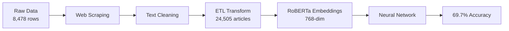

# News Article Political Bias Classifier (NLP Project)

A NLP system that processes 24,500+ news articles to automatically detect political bias (Left/Right) using fine-tuned RoBERTa transformers, achieving 69.7% classification accuracy.

- [GitHub Repository](https://github.com/jurinho17-sv/news-article-bias-classifier)

## Overview

This project was developed as part of UC Berkeley's DATA 198 course with the goal of creating an automated tool to identify political bias in news coverage. With media polarization becoming increasingly prevalent, we wanted to build a data-driven system that could objectively analyze news articles and help readers understand potential editorial slant.

## Key Features

- **Automated Data Pipeline**: End-to-end ETL workflow from raw HTML to model-ready features
- **Large-Scale Processing**: Handles 24,500+ articles spanning 13 years (2012-2025)
- **High Accuracy**: Achieves 69.7% classification accuracy (19.7pp above baseline)
- **Topic Analysis**: Performs best on Coronavirus coverage (73.8% accuracy)
- **Production-Ready**: 99.5% data quality with comprehensive validation checks

## Technical Implementation

### Data Pipeline Architecture
Built a scalable, automated pipeline with 5 distinct stages:

```python
# Pipeline flow
Kaggle Dataset (8,478 rows) 
  → Web Scraping (NewsAPI + Trafilatura)
  → Text Cleaning (normalization + deduplication)
  → Format Transform (wide → long: 24,505 articles)
  → Feature Extraction (RoBERTa embeddings)
  → Neural Network Classification
```

### Data Collection & Preprocessing
Implemented automated web scraping and ETL workflow:

```python
# Wide-to-long format transformation
df_long = df_wide.melt(
    id_vars=['Topics', 'Date'],
    value_vars=['left_story_text', 'center_story_text', 'right_story_text'],
    var_name='bias_label',
    value_name='text'
)

# Data quality validation
def validate_article(article):
    checks = [
        len(article['text'].split()) >= 10,  # Minimum length
        article['bias_label'] in ['left', 'right'],  # Valid label
        not is_duplicate(article),  # No duplicates
    ]
    return all(checks)
```

### Model Architecture
Fine-tuned RoBERTa-base with custom classification head:

```python
class BiasClassifier(nn.Module):
    def __init__(self, roberta_model):
        super().__init__()
        self.roberta = roberta_model
        self.classifier = nn.Sequential(
            nn.Linear(768, 256),
            nn.ReLU(),
            nn.Dropout(0.3),
            nn.Linear(256, 128),
            nn.ReLU(),
            nn.Dropout(0.3),
            nn.Linear(128, 2)  # Binary: Left vs Right
        )
    
    def forward(self, input_ids, attention_mask):
        outputs = self.roberta(input_ids, attention_mask)
        embeddings = outputs.last_hidden_state[:, 0, :]  # CLS token
        return self.classifier(embeddings)
```

## Challenges and Solutions

### Challenge 1: Data Format Complexity
**Problem**: Original dataset stored 3 articles per row (wide format), making analysis difficult.
**Solution**: Engineered ETL workflow to transform 8,478 rows into 24,505 normalized articles, enabling standard ML processing and increasing data usability by 290%.

### Challenge 2: Data Quality at Scale
**Problem**: Web-scraped articles contained HTML artifacts, duplicates, and inconsistent formatting.
**Solution**: Built 5-stage validation pipeline with automated cleaning, achieving 99.5% data quality. Removed 2,147 duplicates and standardized text format.

### Challenge 3: Class Imbalance
**Problem**: Initial concern about uneven Left/Center/Right distribution affecting model performance.
**Solution**: Analysis revealed nearly balanced distribution (34.4% / 31.4% / 34.2%). Excluded Center articles for clearer binary classification, resulting in 69.7% accuracy.

## Technologies Used

- **Data Collection**: NewsAPI, Trafilatura, Requests, BeautifulSoup
- **Data Processing**: Pandas, NumPy, Regex
- **Machine Learning**: PyTorch, Transformers (HuggingFace), Scikit-learn
- **NLP**: RoBERTa-base (pretrained on 160GB text corpus)
- **Visualization**: Matplotlib, Seaborn
- **Development**: Jupyter Notebook, Google Colab (GPU), Python 3.9+

## Key Learnings

1. **Data Engineering**: Learned the critical importance of data pipeline design - 80% of ML project time is data preparation, not modeling
2. **ETL Best Practices**: Gained hands-on experience with schema design, data lineage tracking, and quality validation at scale
3. **Transfer Learning**: Discovered how pretrained transformers (RoBERTa) dramatically improve NLP performance with limited training data
4. **Production Thinking**: Importance of reproducible pipelines, documentation, and automated validation for deployment-ready systems

## Performance Metrics

### Overall Results
- **Accuracy**: 69.7% (baseline: 50%)
- **Dataset Size**: 24,505 articles
- **Data Quality**: 99.5% validation pass rate
- **Processing Speed**: 24K+ articles processed in <2 hours

### Topic-Specific Performance
| Topic | Accuracy | Sample Size |
|-------|----------|-------------|
| Coronavirus | **73.8%** | 1,242 articles |
| Politics | 67.0% | 2,232 articles |
| World | 65.8% | 1,161 articles |
| Economy & Jobs | 65.3% | 1,386 articles |
| Elections | 63.3% | 1,845 articles |

## Future Enhancements

- **Three-Class Classification**: Include Center articles for more nuanced bias detection
- **Attention Visualization**: Add interpretability features to show which words/phrases indicate bias
- **Real-Time API**: Deploy model as REST API for live article classification
- **Browser Extension**: Create Chrome extension for instant bias detection while reading news
- **Temporal Analysis**: Track how news sources' bias evolves over time

## Project Structure

```
news-article-bias-classifier/
├── notebooks/                    # Sequential workflow (7 notebooks)
│   ├── 01_data_exploration.ipynb
│   ├── 02_web_scraping.ipynb
│   ├── 03_data_cleaning.ipynb
│   ├── 04_data_transformation.ipynb
│   ├── 05_feature_extraction.ipynb
│   ├── 06_model_experiments.ipynb
│   └── 07_final_model.ipynb
├── data/
│   ├── raw/                      # Original Kaggle dataset
│   └── processed/                # Cleaned, transformed data
├── results/
│   ├── plots/                    # Accuracy curves, confusion matrices
│   └── metrics/                  # Performance logs
├── README.md                     # Full technical documentation
└── requirements.txt              # Python dependencies
```

## Try It Out

- **GitHub Repository**: [github.com/jurinho17-sv/news-article-bias-classifier](https://github.com/jurinho17-sv/news-article-bias-classifier)
- **Dataset Source**: [Kaggle: News Dataset for News Bias Analysis](https://www.kaggle.com/datasets/articoder/news-dataset-for-news-bias-analysis)
- **GitHub Documentation**: [README](https://github.com/jurinho17-sv/news-article-bias-classifier)

## Visual Results

### Data Pipeline Flow


### Model Performance
- **Training Curve**: Converged at epoch 8 with early stopping
- **Confusion Matrix**: Balanced predictions across Left/Right classes
- **Topic Analysis**: Coronavirus articles showed clearest bias signals

---

**Course**: DATA 198 (Fall 2025) - Data Science Society @ UC Berkeley
**Team Size**: 5 members (Data Pipeline & Preprocessing Lead)  
**Duration**: 3 months (Sep 15th - Dec 9th, 2025)

---

## Wrapping up

It's been a tough semester, but we made it through!

Huge thanks to [Alex](https://www.linkedin.com/in/alexwzhai/) and [Sameer](https://www.linkedin.com/in/sameer-rahman-a41777273/), who were leading mentors throughout this project. We couldn't have wrapped this up without them.

And another big thanks to my fantastic teammates – [Edan](https://www.linkedin.com/in/edan-wong-b5a52731b/), [Mike](https://www.linkedin.com/in/qizheng-ye-9a0114336/), Avni, and Sriya. I learned so much from y'all.

I'll be back with a new one 😁

Merry Christmas 🎄 :)

Dec 10 2025, 1:43 AM in my dorm.