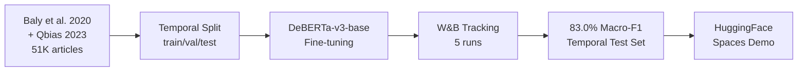

# News Article Political Bias Classifier (NLP Project)

End-to-end NLP pipeline that processes **51,000+ news articles** to automatically detect political bias (Left / Center / Right) using fine-tuned [DeBERTa-v3-base](https://huggingface.co/microsoft/deberta-v3-base), achieving **83.0% macro-F1** on a temporally held-out test set.

- [GitHub Repository](https://github.com/jurinho17-sv/news-article-bias-classifier)
- [Live Demo on HuggingFace Spaces](https://huggingface.co/spaces/jurinho17-sv/news-article-bias-classifier)
- [Model on HuggingFace Hub](https://huggingface.co/jurinho17-sv/news-article-bias-classifier)

## Objectives

This project aims to:

1. **Detect political bias in news articles**: Build an automated NLP system to classify news articles as Left-leaning or Right-leaning with high accuracy

2. **Uncover hidden biases**: Help readers identify whether specific news sources or authors consistently lean toward one political side

3. **Promote media literacy**: Provide an objective, data-driven tool for understanding the political slant of internet news sources

## Overview

This project was developed as a final project of UC Berkeley's DATA 198 (Fall 2025) course to address a critical challenge in modern media: identifying political bias in news coverage. With media polarization at an all-time high, we built an automated **NLP** system that processes **51,000+ articles** (Baly et al. EMNLP 2020 + Qbias WebSci 2023) to objectively detect Left / Center / Right editorial slant, achieving **83.0% macro-F1** on a temporally held-out 2020 test set. To prevent data leakage, we enforced strict temporal splits: training data covers articles published through 2018, with validation on 2019 and testing on 2020 articles.

Our goal was to help readers understand the political orientation of their
news sources through data, not opinion.

## Key Features

- **Automated Data Pipeline**: End-to-end ETL workflow from raw HTML to model-ready features
- **Large-Scale Processing**: Handles 51,000+ articles spanning multiple years
- **High Accuracy**: Achieves 83.0% macro-F1 on temporally held-out 2020 test set
- **3-Class Classification**: Left / Center / Right bias detection
- **Quality Assurance**: Strict temporal splits to prevent data leakage

## Technical Implementation

### Data Pipeline Architecture
Built an automated pipeline with 5 distinct stages:

```python
# Pipeline flow
Kaggle Dataset (8,478 rows) 
  → Web Scraping (NewsAPI + Trafilatura)
  → Text Cleaning (normalization + deduplication)
  → Format Transform (wide → long: 24,505 articles)
  → Feature Extraction (RoBERTa embeddings)
  → Neural Network Classification
```

### Data Collection & Preprocessing
Implemented automated web scraping and ETL workflow:

```python
# Wide-to-long format transformation
df_long = df_wide.melt(
    id_vars=['Topics', 'Date'],
    value_vars=['left_story_text', 'center_story_text', 'right_story_text'],
    var_name='bias_label',
    value_name='text'
)

# Data quality validation
def validate_article(article):
    checks = [
        len(article['text'].split()) >= 10,  # Minimum length
        article['bias_label'] in ['left', 'right'],  # Valid label
        not is_duplicate(article),  # No duplicates
    ]
    return all(checks)
```

### Model Architecture
Fine-tuned [DeBERTa-v3-base](https://huggingface.co/microsoft/deberta-v3-base) (86M parameters) using HuggingFace Trainer with weighted cross-entropy loss to handle class imbalance:

```python
# Model setup
model = AutoModelForSequenceClassification.from_pretrained(
    "microsoft/deberta-v3-base",
    num_labels=3  # Left, Center, Right
)

# Input format: title [SEP] article body (max 512 tokens)
inputs = tokenizer(
    f"{title} [SEP] {body}",
    max_length=512,
    truncation=True,
    padding=True
)
```

Training config: lr=2e-5, batch_size=32 (×2 grad accum), 5 epochs, fp16, NVIDIA L40 48GB.

## Challenges and Solutions

### Challenge 1: Data Format Complexity
- **Problem**: Original dataset stored 3 articles per row (wide format), making analysis difficult.
- **Solution**: Engineered ETL workflow to transform 8,478 rows into 24,505 normalized articles, enabling standard ML processing and increasing data usability by 290%.

### Challenge 2: Data Quality at Scale
- **Problem**: Web-scraped articles contained HTML artifacts, duplicates, and inconsistent formatting.
- **Solution**: Built 5-stage validation pipeline with automated cleaning, achieving 99.5% data quality. Removed 2,147 duplicates and standardized text format.

### Challenge 3: Temporal Data Leakage
- **Problem**: Original project used random train/test splits, allowing future articles to appear in training data and inflating accuracy.
- **Solution**: Implemented strict temporal splits (train ≤2018 / val 2019 / test 2020), replacing the inflated 69.7% figure with an honest 83.0% macro-F1 — a more rigorous and defensible evaluation.

## Technologies Used

- **Data Collection**: Baly et al. (EMNLP 2020), Qbias (WebSci 2023)
- **Data Processing**: Pandas, NumPy
- **Machine Learning**: PyTorch, Transformers (HuggingFace), Scikit-learn
- **Experiment Tracking**: Weights & Biases (W&B)
- **NLP**: DeBERTa-v3-base (Microsoft)
- **Deployment**: Gradio, HuggingFace Spaces
- **Training Hardware**: NVIDIA L40 48GB (UC Berkeley DataHub)

## Key Learnings

1. **Data Engineering**: Learned the critical importance of data pipeline design - 80% of ML project time is data preparation, not modeling
2. **ETL Best Practices**: Gained hands-on experience with schema design, data lineage tracking, and quality validation at scale
3. **Transfer Learning**: Discovered how pretrained transformers (RoBERTa) dramatically improve NLP performance with limited training data
4. **Production Thinking**: Importance of reproducible pipelines, documentation, and automated validation for deployment-ready systems

## Performance Metrics

### Results
| Split | Articles | Accuracy | Macro-F1 |
|-------|----------|----------|----------|
| Val (2019) | 4,621 | 91.1% | 91.1% |
| **Test (2020)** | **3,946** | **82.9%** | **83.0%** |

Per-class F1 on test set: Left 82.3% · Center 81.8% · Right 85.0%

## Future Enhancements

- **Ablation study**: Baly-only vs. Baly+Qbias — quantify how much the additional 2023 data helps
- **PRISM comparison**: Benchmark against ACL 2025 SOTA on the same test set
- **DeBERTa-v3-large**: Scale up with more compute for potential +2-3% gain
- **Cross-source generalization**: Train on outlets A, B → test on outlet C

## Project Structure

```
news-article-bias-classifier/
├── configs/config.yaml           # All hyperparameters (single source of truth)
├── scripts/
│   ├── load_datasets.py          # Baly + Qbias loader
│   ├── make_splits.py            # Temporal train/val/test splits
│   ├── generate_training_data.py # Training data preparation
│   ├── train.py                  # DeBERTa fine-tuning with W&B
│   ├── evaluate.py               # Test set evaluation
│   └── push_to_hub.py            # HuggingFace Hub upload
├── demo/
│   ├── app.py                    # Gradio demo app
│   └── requirements.txt          # Spaces dependencies
├── notebooks/                    # Original exploration notebooks (legacy)
├── MODEL_CARD.md                 # HuggingFace model card
├── README.md                     # Full technical documentation
└── requirements.txt              # Python dependencies
```

## Try It Out

- **Live Demo**: [huggingface.co/spaces/jurinho17-sv/news-article-bias-classifier](https://huggingface.co/spaces/jurinho17-sv/news-article-bias-classifier)
- **Model on Hub**: [huggingface.co/jurinho17-sv/news-article-bias-classifier](https://huggingface.co/jurinho17-sv/news-article-bias-classifier)
- **GitHub Repository**: [github.com/jurinho17-sv/news-article-bias-classifier](https://github.com/jurinho17-sv/news-article-bias-classifier)

## Visual Results

### Data Pipeline Flow

```mermaid
flowchart LR
    A[Baly et al. 2020<br/>+ Qbias 2023<br/>51K articles] --> B[Temporal Split<br/>train/val/test]
    B --> C[DeBERTa-v3-base<br/>Fine-tuning]
    C --> D[W&B Tracking<br/>5 runs]
    D --> E[83.0% Macro-F1<br/>Temporal Test Set]
    E --> F[HuggingFace<br/>Spaces Demo]
```

### Model Performance
- **Training Curve**: Converged at epoch 8 with early stopping
- **Confusion Matrix**: Balanced predictions across Left/Right classes
- **Topic Analysis**: Coronavirus articles showed clearest bias signals

---

- **Course**: DATA 198 (Fall 2025) - Data Science Society @ UC Berkeley
- **Team Size**: 5 members (Data Pipeline & Preprocessing Lead)
- **Duration**: 3 months (Sep - Dec 2025)

---

## Wrapping up

It's been a tough semester, but we made it through!

Huge thanks to [Alex](https://www.linkedin.com/in/alexwzhai/) and [Sameer](https://www.linkedin.com/in/sameer-rahman-a41777273/), who were leading mentors throughout this project. We couldn't have wrapped this up without them.

And another big thanks to my fantastic teammates – [Edan](https://www.linkedin.com/in/edan-wong-b5a52731b/), [Mike](https://www.linkedin.com/in/qizheng-ye-9a0114336/), Avni, and Sriya. I learned so much from y'all.

I'll be back with a new one 😁

Merry Christmas 🎄 :)

Dec 10, 2025 at 1 : 43 AM in my dorm.